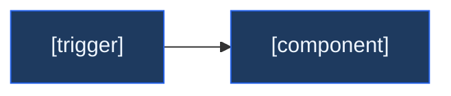

# Skill: new-epic

## Purpose

Scaffold one complete Epic with all supporting structure, including the inventory + implementation-update log + story-dep DAG placeholders that downstream agents need.

## Input

Required:
- **Epic ID** (or domain + auto-assign)
- **Epic title**
- **Phase** folder
- **Goal** (one sentence)

Optional: Feature names, milestone names, story count

## Protocol

### Step 1 — Validate

Read `PROJECT_CONTEXT.yaml` and `{paths.agile_index}`. Confirm:
- Epic ID does not already exist
- Phase folder exists at `{paths.epics}/{phase}/` (create if needed)
- Domain exists in PROJECT_CONTEXT.yaml (add if needed)

### Step 2 — Ensure phase README exists

If `{paths.epics}/{phase}/README.md` does **not** exist, create it from `templates/phase-README.md`:
- Fill phase outcome, target date, owner
- Leave the Epic Dependency DAG with placeholder edges; `/prd-to-roadmap` (or a future re-run) will populate it
- Add this new epic to the "Epics in this Phase" table

If the phase README **does** exist, append this epic's row to the existing "Epics in this Phase" table.

### Step 3 — Create Folder Structure

```
{paths.epics}/{phase}/{EPIC-ID}/
  EPIC.md
  ARCHITECTURE.mmd
  ENV.yaml
  features/.gitkeep
  milestones/.gitkeep
  stories/.gitkeep
```

### Step 4 — Populate EPIC.md

Copy from `{paths.templates}/EPIC.md`, replace placeholders. **All sections must be present, even if empty:**

| Section | When new-epic alone runs | When /prd-to-roadmap also runs |
|---------|--------------------------|--------------------------------|
| Goal | Filled from input | Filled |
| Root Cause / Pre-Story Analysis | Stub with prompts | Auto-filled from PRD |
| Features in this Epic | Header only | Populated with F-IDs |
| Milestones | Header only | Populated with M-IDs |
| Stories in this Epic | Header only | Populated with US-IDs + Order + Blocked By |
| Story Dependency DAG | Empty mermaid block | Mermaid populated from blocked_by |
| Files touched (inventory) | Empty table | Pre-seeded from "Primary files touched" |
| Architecture Notes (inline) | Stub | Populated by architect-agent on `/design-epic` |
| Out of Scope (Epic Level) | Stub | Filled from PRD |
| Definition of Done (Epic) | Checklist | Same |
| Implementation Update (log) | Empty (with example format) | Empty (with example format) |

### Step 5 — Create ARCHITECTURE.mmd (stub or invoke architect-agent)

Minimal stub or invoke `architect-agent` for a real diagram. The stub uses the standard classDef styling so `/design-epic` only adds nodes:



### Step 6 — Create ENV.yaml (stub)

```yaml
epic: {EPIC-ID}
required: []
```

### Step 7 — Update Trackers

- AGILE_INDEX.md: add epic row to phase table
- PHASE_TRACKER.md: add epic deliverables row
- PROJECT_CONTEXT.yaml: increment domain's epic counter
- `{paths.epics}/{phase}/README.md`: epic row added (Step 2)

### Step 8 — Print Summary

```
Epic created: {EPIC-ID}
  Phase: {phase}
  Phase README: {created | already present}
  Path: {paths.epics}/{phase}/{EPIC-ID}/
  Files: EPIC.md · ARCHITECTURE.mmd · ENV.yaml
  Trackers: updated
  EPIC.md sections present: Goal · Pre-Story Analysis · Stories table · Story DAG (empty) · Files inventory (empty) · Architecture Notes · Implementation Update (empty)

Next: /design-epic {EPIC-ID} to deep-fill architecture
```

## Edge Cases

| Situation | Rule |
|-----------|------|
| Domain doesn't exist | Add to PROJECT_CONTEXT.yaml first |
| Phase folder doesn't exist | Create with phase-README.md from template (Step 2 covers this) |
| Phase README exists but lacks DAG block | Add the empty DAG block; do not overwrite existing content |
| Epic already exists | STOP. Ask if user wants to extend instead |

---

*Skill version: 2.0.0 | Updated: 2026-05-21 | Changes: ORION v0.2.0 — phase-README guarantee, EPIC.md sections inventory*
