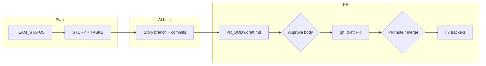

# How to Use — Hybrid Agile AI Workflow

> **What this guide covers:** How to plan, build, review, and track work using the hybrid system (our Agile hierarchy + Gauntlet's Three Pillars). Every section answers a concrete question: what do I do right now?  
> **Time to read:** 15 minutes. Time to apply for the first story: 30 minutes.

---

## The Big Picture (Read This First)

Everything maps to one hierarchy:

```
Phase          → Business outcome visible to executives (PHASE_TRACKER.md)
  Epic         → Domain-level goal, 3–8 weeks (EPIC.md + ARCHITECTURE.mmd)
    Milestone  → Shippable sub-goal, 1–2 weeks (MILESTONE.md + PR-PLAN.md)
      Story    → One user-facing capability, 1 AI session (STORY.md)
        Task   → One file change, maps to an AC (TASKS.md)
          PR   → One merged branch = one Story
```

**Three Pillars inside every Story (from Gauntlet):**

| Pillar | File | What it gives the AI |
|--------|------|---------------------|
| **Brain** | `STORY.md` | Scope, intent, ACs, what NOT to build |
| **Muscle** | `TASKS.md` | Exact files to touch, ordered tasks, test commands |
| **Map** | `ARCHITECTURE.mmd` | Data flow diagram — where things live and how they connect |

**Rule:** All three pillars must be filled before opening the AI chat. A missing pillar = a wasted session.

### Story → PR in the AI-assisted loop

After the AI session implements on a **story branch**, you close the loop with **draft PR body → human approval → GitHub draft PR → (optional) ready for review → merge → §7 trackers**. Commands and the full diagram live in **[guides/STORY_PR_WORKFLOW.md §0](guides/STORY_PR_WORKFLOW.md#0-in-the-ai-assisted-agile-cycle)**.



---

## When Do I Do What?

| Situation | What to do | Section |
|-----------|-----------|---------|
| Starting a new product or project | Bootstrap: Phase → Epic → Milestone | [§1 Bootstrap](#1-bootstrap-a-new-product-or-project) |
| Starting work on a new feature area | Create an Epic | [§2 Create an Epic](#2-create-an-epic) |
| Planning a sprint or 2-week chunk | Create a Milestone + PR-PLAN | [§3 Create a Milestone](#3-create-a-milestone) |
| Picking the next thing to build | Read TEAM_STATUS.md → find "Ready to Start" | [§4 Pick a Story](#4-pick-a-story) |
| About to start an AI coding session | Fill STORY.md + TASKS.md → run pre-flight | [§5 Run an AI Session](#5-run-an-ai-session) |
| AI session is done | Review against ACs, merge PR | [§6 Review and Merge](#6-review-and-merge) |
| Opening a story PR (draft → approve → `gh`) | [STORY_PR_WORKFLOW.md](guides/STORY_PR_WORKFLOW.md) · `npm run pr:story -- …` · `.cursor/commands/pr-story-draft-publish.md` | [Story PR workflow](guides/STORY_PR_WORKFLOW.md) |
| Story is done — update tracking | Tick off ACs, update all trackers | [§7 Close a Story](#7-close-a-story) |
| Reporting status to stakeholders | Open PHASE_TRACKER.md | [§8 Executive Reporting](#8-executive-reporting) |
| Checking what the team is working on | Open TEAM_STATUS.md | [§9 Team Check-in](#9-team-check-in) |
| Setting up Linear + GitHub | Follow LINEAR_GITHUB.md | [§10 Toolchain Setup](#10-toolchain-setup-linear--github) |

---

## 1. Bootstrap a New Product or Project

Do this once when the product is new. After this, you jump straight to §2 for each feature area.

**Step 1 — Write the PRD (Brain at product level)**

Create `docs/agile/PRD.md` (or use the existing `docs/roadmap/PRODUCT_ROADMAP.md`). It must answer:
- What is this product?
- Who are the users?
- What phases does it have?
- What is explicitly out of scope?

**Step 2 — Populate PHASE_TRACKER.md**

Open [PHASE_TRACKER.md](PHASE_TRACKER.md). For each phase:
- Write the business outcome in plain language (not technical)
- Set the timeline
- List the domains (PAY, DESIGN, AUTH, etc.) that have work in this phase
- Set all phase gate criteria

**Step 3 — Set up ENV.yaml**

Open [ENV.yaml](ENV.yaml). Add the canonical paths for your project:
- Repo root
- Key module paths (API, frontend, tests)
- Dev commands
- `NEVER_COMMIT` list

**Step 4 — Set up TEAM_STATUS.md**

Open [TEAM_STATUS.md](TEAM_STATUS.md). Add a section for each domain in your product. Under each: "Now: nothing. Next: [first epic]. Blocked: nothing."

**Step 5 — Create the first Epic** → go to §2.

---

## 2. Create an Epic

An epic is a domain-level goal: "MVP Payments Live", "UI Design Consistency", "B2B API". One epic per domain per phase is typical.

**Step 1 — Copy the EPIC template**

```bash
# Replace EPIC-PAY-01 with your epic ID
EPIC_ID="EPIC-PAY-01"
mkdir -p docs/agile/epics/$EPIC_ID/milestones
mkdir -p docs/agile/epics/$EPIC_ID/stories
cp docs/agile/templates/EPIC.md docs/agile/epics/$EPIC_ID/EPIC.md
```

**Step 2 — Fill EPIC.md (10 minutes)**

Open the new `EPIC.md` and fill:
- [ ] Phase: which phase does this belong to?
- [ ] Goal: one sentence — what changes for the user when this is done?
- [ ] Why now: the business reason
- [ ] Success metric: how will you know it's done?
- [ ] Milestones: 2–3 shippable sub-goals (stubs are fine — fill details in §3)
- [ ] Out of scope at epic level

**Step 3 — Draw ARCHITECTURE.mmd (Gauntlet Pillar 3 — Map)**

This is the most important step for AI context. Create `docs/agile/epics/$EPIC_ID/ARCHITECTURE.mmd`.

It must show:
- Where data enters the system (user action, API call, etc.)
- Which files/modules are touched in this epic
- Which components are **correct** (green) vs **broken/target** (red)
- What must NOT be touched (outside scope)

Use the template in [EPIC.md Architecture Notes section](templates/EPIC.md). Render it at [mermaid.live](https://mermaid.live) to verify it looks right.

**Example structure:**
```
flowchart LR
  subgraph Input["User / Trigger"]
    A["user action"]
  end
  subgraph Module["Component Group"]
    B["file-A.ts — correct"]:::good
    C["file-B.ts — broken"]:::bad
  end
  A --> B --> C
  classDef good fill:#0b3b2e,color:#ecfdf5;
  classDef bad  fill:#3b0b0b,color:#fef2f2;
```

**Step 4 — Create per-epic ENV.yaml**

Copy and fill `docs/agile/epics/$EPIC_ID/ENV.yaml`:
- `EPIC_SCOPE`: exact file paths the AI is allowed to touch
- `NEVER_TOUCH_IN_THIS_EPIC`: files explicitly off-limits

**Step 5 — Add Epic to AGILE_INDEX.md and PHASE_TRACKER.md**

- AGILE_INDEX.md: add a row to "Active Epics" table
- PHASE_TRACKER.md: add the epic to the relevant phase's "Planned Epics" table
- TEAM_STATUS.md: update the domain section to show this epic as "Active"

---

## 3. Create a Milestone

A milestone is a shippable sub-goal within an epic — something you can demo or deploy. Aim for 1–2 weeks of AI coding sessions.

**Step 1 — Copy the Milestone template**

```bash
EPIC_ID="EPIC-DESIGN-01"
M_ID="M-DESIGN-02-editor-tokens"
cp docs/agile/templates/MILESTONE.md docs/agile/epics/$EPIC_ID/milestones/$M_ID.md
```

**Step 2 — Fill MILESTONE.md (5 minutes)**

- Goal: one sentence — what is shippable when this milestone closes?
- Stories: which stories belong here? (stubs are fine — just IDs)
- Acceptance: what must be true for this milestone to be "done"?
- Target date

**Step 3 — Write PR-PLAN.md (10 minutes)**

This is the Gauntlet-inspired sequencing step. Create `{M_ID}-PR-PLAN.md` alongside the milestone:

```markdown
## PR Sequence

### PR 1 — US-{DOMAIN}-NNN: {title}
Rationale: {why this PR exists and why it comes before the next}
Depends on: {nothing, or PR N}
Blocks: {PR N+1, or nothing}
```

List every PR in execution order. Show dependencies. This document is what the AI reads to understand *why* a PR exists — not just *what* it does.

**Step 4 — Update EPIC.md milestone table**

Add the milestone to the EPIC.md milestones table with status 🔲.

---

## 4. Pick a Story

This is the daily "what do I work on?" decision.

**Open [TEAM_STATUS.md](TEAM_STATUS.md)**

Find your domain section. Look for stories under **"Ready to Start"** — these have:
- STORY.md filled
- TASKS.md filled (or ready to fill)
- No blocking dependencies

If nothing is "Ready to Start", check "Now (In Progress)" — is the current story blocked? If blocked, unblock it before starting something new.

**If the next story doesn't have a STORY.md yet** — go to §5 Step 1 to write it.

**Picking rule:** One story at a time. Never start a new story while a branch for another story is open and unmerged.

---

## 5. Run an AI Session

This is the core loop. Every feature you ship starts here.

---

### Step A — Write the Story (5 minutes, before opening AI)

**Only skip this if STORY.md is already filled.** Writing the story IS the planning — it forces you to define scope before you code.

```bash
EPIC_ID="EPIC-DESIGN-01"
US_ID="US-DESIGN-002"
mkdir -p docs/agile/epics/$EPIC_ID/stories/$US_ID
cp docs/agile/templates/STORY.md docs/agile/epics/$EPIC_ID/stories/$US_ID/STORY.md
cp docs/agile/templates/TASKS.md docs/agile/epics/$EPIC_ID/stories/$US_ID/TASKS.md
```

Fill **STORY.md**:
1. Story statement: *As a [persona] I want [capability] so that [outcome]*
2. Acceptance Criteria: 3–6 specific, testable conditions. **Write these before the AI prompt.**
3. Out of scope: explicitly list what this story does NOT implement — this is what prevents AI drift
4. Primary files touched: list the 3–8 files you expect to change
5. AI Implementation Prompt: write the ready-to-paste prompt (see template)

> **If you can't write 3 ACs for a story, the story is too vague. Split it or clarify intent first.**

---

### Step B — Fill TASKS.md (10 minutes, before opening AI)

This is the Gauntlet "Muscle" pillar — the exact implementation contract.

Fill **TASKS.md**:
1. PR Scope Summary: one-line commit message you'll use
2. Task breakdown: one task per file, with:
   - Which AC(s) this task satisfies
   - What specifically changes (line numbers if known from pre-audit)
   - The exact `git add` + `git commit` command for this task
3. File-to-Task Mapping table: cross-reference
4. Exact Test Commands: copy-paste ready, not "run the tests"
5. Anti-patterns: what the AI tends to drift into for this type of change

---

### Step C — Three Pillars Pre-flight Check

Before you open the AI chat, verify all four items:

```
☐ Brain  — STORY.md: ACs written, out-of-scope listed, AI prompt ready
☐ Muscle — TASKS.md: file list + ordered tasks + test commands filled
☐ Map    — ARCHITECTURE.mmd exists for this epic (AI sees data flow)
☐ Env    — ENV.yaml exists (AI uses ${env.*} paths, not guesses)
```

If any box is unchecked → fill it now. Opening the AI with an incomplete brief produces incomplete code.

---

### Step D — Create the Branch

```bash
git checkout main && git pull
git checkout -b feat/{domain}-{story-slug}
# Example:
git checkout -b feat/design-us-design-002-editor-tokens
```

---

### Step E — Paste the AI Prompt

Open Claude Code (this tool). Paste the **"AI Implementation Prompt"** block from STORY.md exactly as written. It includes:
- Context line (product, stack, ports)
- Story statement + ACs
- Scope (exact file list from ENV.yaml)
- Token/pattern replacement rules (if applicable)
- "Do NOT change" list (from out-of-scope + NEVER_TOUCH)

Add at the end:
```
When done: list files changed, which ACs are satisfied, run `npm run check` and report the result.
```

---

### Step F — Commit Atomically (one file per task)

As the AI produces changes, stage and commit task by task — not all at once:

```bash
# Stage only the file for this task
git add client/src/components/editor/EditorToolbar.tsx

# Commit with story ID
git commit -m "feat(editor): EditorToolbar bg-gray-900→bg-background — US-DESIGN-002"
```

**Why atomic commits:** If a regression appears later, `git bisect` finds the exact file. AI-generated changes are easier to review file by file.

**Never:**
```bash
git add -A       # ← can accidentally commit .env, unrelated files
git add .        # ← same problem
```

---

## 6. Review and Merge

Review against ACs — not against "does it look right?". ACs are the exit condition.

### Step A — Run the test commands

```bash
# From TASKS.md "Exact Test Commands" section
npm run check        # TypeScript — must pass
npm run test:unit    # Unit tests — must pass

# Test is truth rule:
# If these fail → fix the code, not the test
# Do not open a PR until these pass
```

### Step B — AC verification (go through each one)

For each AC in STORY.md:

| Result | Action |
|--------|--------|
| ✅ Pass | Check the box in STORY.md |
| ❌ Fail | Tell the AI exactly which AC failed + what you observed. One fix per message. |
| ⚠️ Pass with finding | Check the box but add a finding note in the TC table |
| ⏸ Blocked | Note why (missing API, env var, live service). Defer with reason. |

Do not mark an AC ✅ because it "looks done". Run the test command for it.

### Step C — Visual check (for UI changes)

```bash
npm run dev
# Open localhost:5000
# Test the exact flow described in TASKS.md "Manual" section
# Check both Light AND Dark mode if the story touches theme/visual
```

### Step D — Verify diff is clean

```bash
git diff origin/main --name-only
# Should show ONLY the files listed in TASKS.md File-to-Task Mapping
# Any surprise file? Unstage it. Investigate why it changed.
```

### Step E — Open the PR

**Canonical guide:** [guides/STORY_PR_WORKFLOW.md](guides/STORY_PR_WORKFLOW.md) (GitHub templates in `.github/`, optional `PR_BODY.md` per story, `gh pr create --body-file`, Cursor command `pr-story-open`).

Quick pattern:

```bash
git push -u origin HEAD
gh pr create \
  --base main \
  --title "[US-{DOMAIN}-{NNN}] {short title}" \
  --body-file docs/agile/epics/{EPIC-ID}/stories/{US-ID}/PR_BODY.md
```

If `PR_BODY.md` does not exist yet, paste **STORY.md** (story + ACs + tests + out of scope) into the PR body, or use the **story** template when GitHub offers the template dropdown (`?template=story.md`).

**Dynamic story id:** `npm run pr:story -- resolve US-DESIGN-003` then `npm run pr:story -- create US-DESIGN-003 --title "[US-DESIGN-003] …" --draft` (see [STORY_PR_WORKFLOW.md](guides/STORY_PR_WORKFLOW.md)). **US-DESIGN-002 one-liner:** `npm run pr:open:us-design-002`.

---

## 7. Close a Story

After the PR merges, update four places — takes 5 minutes.

**1. STORY.md** — set status to `✅ Done`, fill PR number:
```markdown
> **Status:** ✅ Done
> **PR:** #42
```

**2. EPIC.md** — update the story row:
```markdown
| US-DESIGN-002 | Editor token replacement | M-DESIGN-02 | ✅ Done | #42 |
```

**3. TEAM_STATUS.md** — move story from "Now" to "Done":
```markdown
### Done (this Epic)
| US-DESIGN-002 | Token replacement | #42 | 2026-04-20 ✅ |
```

**4. PHASE_TRACKER.md** — recalculate phase %, update epic status:
```markdown
| EPIC-DESIGN-01 | Design | UI theme + editor | 🟡 In Progress | 1/4 stories ✅ | ...
```

If this story completes the last AC needed for a **Milestone**, also:
- Update `MILESTONE.md` status → ✅ Done
- Update `PR-PLAN.md` — mark that PR complete

If this completes the last milestone in an **Epic**:
- Update `EPIC.md` status → ✅ Done
- Update `AGILE_INDEX.md` epic row → ✅ Done
- Update `PHASE_TRACKER.md` phase % and check if phase gate now passes

---

## 8. Executive Reporting

**Open [PHASE_TRACKER.md](PHASE_TRACKER.md)**

This is the single document executives read. It shows:
- Phase 0 is 98% complete, 3 human tasks block go-live
- Phase 1 starts after Phase 0 gate passes
- Phase 1 will deliver: usage dashboard, payment method management
- Phase 1 effort: ~15–20 hours, Week 2–3 post-launch

**To update after any story merges:**

1. Find the phase containing the epic where the story lives
2. Recalculate: `stories ✅ / total stories × 100`
3. Update the "Complete %" column in the At-a-Glance table
4. If a phase gate condition is now met, tick the checkbox in the Gate Criteria section

**What executives ask and where the answer lives:**

| Question | Answer location |
|----------|----------------|
| "When does Phase 1 ship?" | PHASE_TRACKER.md → Phase 1 → Timeline |
| "What does Phase 1 include?" | PHASE_TRACKER.md → Phase 1 → Scope Summary |
| "Is Phase 0 really done?" | PHASE_TRACKER.md → Phase 0 → Gate Criteria checkboxes |
| "What's blocking us?" | TEAM_STATUS.md → domain section → Blocked |
| "What comes after payments?" | PHASE_TRACKER.md → Phase 2+ |

---

## 9. Team Check-in

**Open [TEAM_STATUS.md](TEAM_STATUS.md)**

This is the domain-level board. Each domain (PAY, DESIGN, AUTH, EDIT, AI, INFRA, ORG) has:
- **Now**: actively being coded this session/week
- **Blocked**: can't proceed, reason listed
- **Next**: ready to start as soon as "Now" is done
- **Done**: shipped in this epic

**Daily standup pattern (solo or small team):**
1. Read "Now" — is the current story still in progress or done?
2. If done → move to "Done", promote "Next" to "Now"
3. If blocked → what unblocks it? Can a different domain's story be done in parallel?
4. Update PHASE_TRACKER.md if a story just closed

---

## 10. Toolchain Setup (Linear + GitHub)

**One-time setup — do this once per project.**

### GitHub Labels

```bash
# Run once in your repo
gh label create "epic:design"    --color "6366f1"
gh label create "epic:payments"  --color "22c55e"
gh label create "epic:auth"      --color "f59e0b"
gh label create "epic:editor"    --color "06b6d4"
gh label create "epic:ai"        --color "ec4899"
gh label create "epic:infra"     --color "94a3b8"
gh label create "type:feat"      --color "3b82f6"
gh label create "type:fix"       --color "ef4444"
gh label create "type:test"      --color "84cc16"
gh label create "priority:P0"    --color "dc2626"
gh label create "priority:P1"    --color "f97316"
gh label create "priority:P2"    --color "facc15"
```

Full setup guide: [LINEAR_GITHUB.md](LINEAR_GITHUB.md)

### Linear Project Setup

1. Create one **Linear Project** per Epic
2. Create one **Linear Issue** per Story (copy STORY.md title)
3. Install Linear GitHub App (Settings → Integrations → GitHub)
4. Include `Closes LIN-{id}` in commit messages to auto-close issues on PR merge

### Commit Format

```
{type}({scope}): {what} — {story-id}

feat(editor): replace hardcoded gray tokens — US-DESIGN-002
fix(payments): webhook PENDING→ACTIVE race condition — US-PAY-003
test(auth): add JWT refresh integration test — US-AUTH-002
```

Full conventions: [GIT_STRATEGY.md](GIT_STRATEGY.md)

---

## Quick Reference Card

### Daily Loop (30–120 min per story)

```
1. TEAM_STATUS.md → find "Ready to Start" story
2. STORY.md → fill ACs + out-of-scope (if not done)
3. TASKS.md → fill file list + tasks + test commands
4. Pre-flight: Brain ✅ Muscle ✅ Map ✅ Env ✅
5. git checkout -b feat/{domain}-{story-slug}
6. Paste AI Implementation Prompt → AI codes
7. git add {specific file} && git commit -m "feat(scope): ... — US-XXX"
8. npm run check && npm run test:unit  ← must pass
9. Review each AC → ✅ or ❌ with finding
10. gh pr create → paste STORY.md as body
11. Merge → update STORY.md + EPIC.md + TEAM_STATUS + PHASE_TRACKER
```

### File Purpose at a Glance

| File | When you open it |
|------|-----------------|
| [AGILE_INDEX.md](AGILE_INDEX.md) | First file in any session — navigation hub |
| [PHASE_TRACKER.md](PHASE_TRACKER.md) | Reporting to stakeholders, phase gate decisions |
| [TEAM_STATUS.md](TEAM_STATUS.md) | Daily standup, picking next story, checking blockers |
| `epics/{E}/EPIC.md` | Understanding the domain goal, epic scope |
| `epics/{E}/ARCHITECTURE.mmd` | Before AI session — give AI the system map |
| `epics/{E}/ENV.yaml` | Before AI session — canonical file paths |
| `epics/{E}/milestones/{M}-PR-PLAN.md` | Sequencing PRs in a milestone |
| `stories/{US}/STORY.md` | Writing ACs + AI prompt (Brain pillar) |
| `stories/{US}/TASKS.md` | File-level task list + test commands (Muscle pillar) |
| [GIT_STRATEGY.md](GIT_STRATEGY.md) | Branch names, commit format, PR template |
| [LINEAR_GITHUB.md](LINEAR_GITHUB.md) | Setting up Linear ↔ GitHub integration |
| [ENV.yaml](ENV.yaml) | Global canonical paths — reference in AI prompts |

### Key Rules (Never Break These)

| Rule | Reason |
|------|--------|
| Write ACs before opening AI | ACs are the exit condition. No ACs = can't review. |
| Stage files by name, never `git add -A` | Prevents accidental `.env` commits |
| One story per branch | One PR = one story = one reviewable unit |
| Test is truth | Never weaken a test to make it pass — fix the code |
| All 3 pillars before AI session | Missing context = AI drifts, work is redone |
| Commit with story ID | `— US-DESIGN-002` makes `git log` traceable forever |
| Update 4 files after merge | STORY.md + EPIC.md + TEAM_STATUS + PHASE_TRACKER |

### Story Size Check

If a story is too big to do in one AI session (2–4 hours), split it:
- More than 8 files → split by file group
- More than 6 ACs → split by user scenario
- More than one domain touched → split by domain
- "And then..." in the story statement → split at the "and"

### Anti-patterns That Waste Sessions

| What you did | What went wrong | Fix |
|---|---|---|
| Started AI without ACs | AI guessed intent; output doesn't match need | Always write 3 ACs first |
| Pasted a vague prompt | AI implemented extra features | Include "Out of scope" in the prompt |
| `git add -A` | Committed unrelated or sensitive files | Stage by filename only |
| Didn't check Architecture diagram | AI touched wrong module | Open ARCHITECTURE.mmd before session |
| Reviewed by eye ("looks done") | Bugs shipped | Run every test command in TASKS.md |
| Fixed failing test by weakening assertion | Bug hidden, surfaces later | Fix code, never the test |
| Started Story 2 before Story 1 merged | Context conflict, messy branches | One branch open at a time |

---

## Real Example: US-DESIGN-002 (Next Story to Run)

This is a live story — fully planned, ready to start. Use it as your first run-through of this workflow.

```bash
# 1. Verify pre-flight (all already done)
#    Brain:  docs/agile/epics/EPIC-DESIGN-01/stories/US-DESIGN-002/STORY.md ✅
#    Muscle: docs/agile/epics/EPIC-DESIGN-01/stories/US-DESIGN-002/TASKS.md ✅
#    Map:    docs/agile/epics/EPIC-DESIGN-01/ARCHITECTURE.mmd ✅
#    Env:    docs/agile/epics/EPIC-DESIGN-01/ENV.yaml ✅

# 2. Create branch
git checkout main && git pull
git checkout -b feat/design-us-design-002-editor-tokens

# 3. Copy the "AI Implementation Prompt" from STORY.md into Claude Code
#    (It's the fenced code block near the bottom of STORY.md)

# 4. AI codes T1–T10, you commit each file atomically

# 5. Verify
npm run check
npm run test:unit

# 6. Open PR
gh pr create \
  --title "[US-DESIGN-002] Editor design token replacement" \
  --label "epic:design,type:feat,priority:P1"

# 7. After merge: update STORY.md → ✅ Done, fill PR #
#    Update EPIC.md story row, TEAM_STATUS, PHASE_TRACKER
```

Everything needed is in `docs/agile/epics/EPIC-DESIGN-01/stories/US-DESIGN-002/`.

---

*See also: [AGILE_INDEX.md](AGILE_INDEX.md) · [GIT_STRATEGY.md](GIT_STRATEGY.md) · [PHASE_TRACKER.md](PHASE_TRACKER.md) · [TEAM_STATUS.md](TEAM_STATUS.md)*
