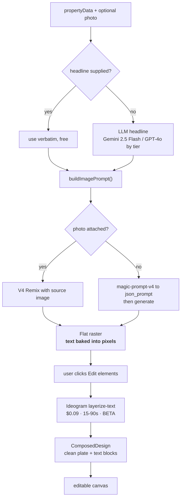
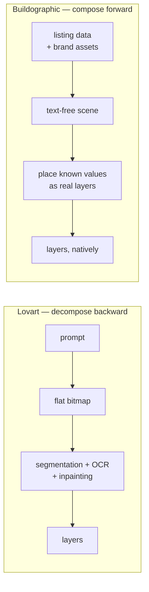
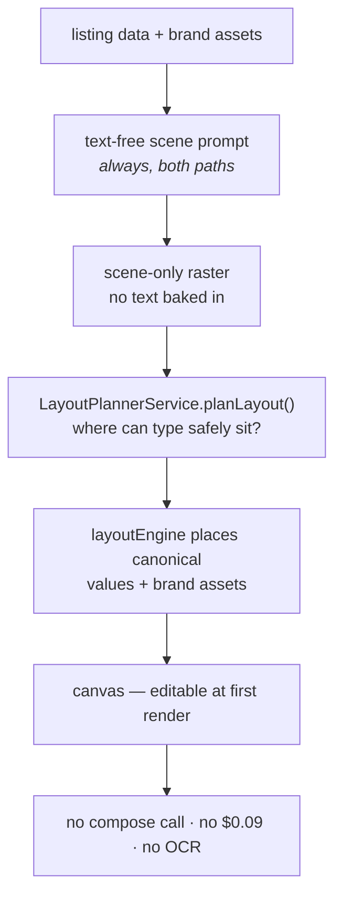

# PRD — Editable Layers UX Flow

> Rebuilds the "Edit elements" experience on top of the implementation that already exists.
> This is mostly **deleting decision logic**, not adding features: every loader, resolver and
> API call this flow needs is already built and working. What's missing is a single, honest
> source of truth for what the canvas is currently showing.

---

## 1. What's actually broken

Reported symptom: *"still not getting editable results"* — the canvas shows
**"✓ Editable layers active"** over a design whose text is plainly baked in.

Verified cause. The screenshot's layers are the **template's own** (`ps-headline`,
`ps-pricechip`, `ps-facts`, `ps-agent`) — there is no AI generation on that canvas at all.
The pill lights up because:

```ts
const isEditableMode = renderMode === 'editable' || hasExtractedLayers;
```

`renderMode` is a **global, session-sticky preference**, mutated from two unrelated places:

| Where | What it does |
|---|---|
| `AIChatBox.tsx:1448,1455,1595,1602` | user-facing Flat/Editable toggle — an *intent* for the next generation |
| `CanvasEditToolbar.tsx:112` | silently set to `'editable'` after every successful compose |

Once either fires, **every** canvas in that session reports "Editable layers active" until
reload — including a freshly-opened template with no AI content whatsoever.

So the control is **reporting a preference, not the state of the canvas.** No further patching
of the heuristic fixes this; the model itself is wrong.

### The structural problem

| # | Problem |
|---|---|
| 1 | **Three disagreeing sources of truth** for "is this editable": sticky `renderMode`, a canvas-content heuristic, and `activeGenerationId` |
| 2 | **Two loaders with incompatible semantics** (see below) |
| 3 | **"Editable" means three unrelated things**: template slots are already real text · an AI raster has been layer-extracted · the user's preference for the next load |
| 4 | **Three surfaces decide independently** — `CanvasEditToolbar`, `CenterCanvas`, `RightSidebar` each call the loaders with their own logic |

Problem 2 is the root of the incoherent hybrid canvas:

| Loader | Semantics |
|---|---|
| `loadAiVariationToCanvas` (`canvasState.ts:315`) | **preserves** existing elements, inserts the AI image *behind* them at `minZIndex - 1` (US-AI-036 AC3) |
| `loadComposedDesignToCanvas` (`canvasState.ts:513`) | **replaces the entire canvas** with composed background + slot-tagged text |

Open a template, generate, and the AI image slides *underneath* the template's placeholder
copy — you are looking at template text over an AI photo, which is neither design.

---

## 2. Design principle

> **The canvas states what it is. Nothing else gets a vote.**

Control state is derived from **provenance on the elements**. `renderMode` stops being a state
input entirely and survives only as *intent* for the next generation.

---

## 3. The flow

### 3.1 Placement choice — decided 2026-08-25

When a generation is placed **and the canvas has a deliberate origin** (a template is loaded),
ask once:

```
  Generated design ready
  +----------------------------------+
  | ( ) Replace the template         |
  |     Use the AI design on its own |
  | ( ) Use as background            |
  |     Keep template text on top    |
  |            [ Continue ]          |
  +----------------------------------+
```

- **Blank canvas → never ask.** Existing US-AI-036 AC4 path, unchanged.
- **Remembered for the editor session**, so placing further variations doesn't re-prompt.
  Re-asked when a different template is opened.
- Both outcomes already exist in code: they are precisely the two branches of
  `loadAiVariationToCanvas`. The change is to select the branch **by user choice** instead of
  by the `hasDeliberateOrigin` heuristic.

**US-AI-036 AC3 is preserved**, not reversed: "Use as background" *is* AC3. It stops being the
silent default and becomes an explicit, named option. Record as an amendment to US-AI-036
(the default path changes even though both behaviours remain reachable).

### 3.2 Control state machine

One derived value, read from the canvas. No preference input.

| Canvas state | Control | Action |
|---|---|---|
| No AI raster present | **hidden** | — template slots are already editable text; never call that "layers" |
| AI raster, not extracted | **"Separate text layers"** | compose |
| Compose in flight | **"Separating…"** + progress | — |
| Composed layers present | **"Text layers active"** | (revert — see §6) |
| Blocked by quota | **"Upgrade to edit"** | upgrade dialog |

Derivation, replacing `isEditableMode` wholesale:

```ts
const hasComposedLayers = elements.some((el) => el.id.startsWith('composed-'));
const aiRaster = elements.find((el) => el.type === 'image' && el.isAiImport && !hasComposedLayers);
// state = composing ? 'extracting' : hasComposedLayers ? 'layered' : aiRaster ? 'flat' : 'none'
```

The key consequence: **"Use as background" hides the control**, because the text the user would
want to edit is the template's — and that is already real, selectable text. This is what
resolves the overloaded meaning of "editable".

---

## 4. What changes in code

Everything below reuses what exists. Net effect is less logic, not more.

| Change | File | Size |
|---|---|---|
| Expose the two placement behaviours as an explicit `mode: 'replace' \| 'behind'` param instead of inferring from `hasDeliberateOrigin` | `lib/canvasState.ts:315` | XS — both branches already written |
| Placement choice dialog + session memory | `RightSidebar.tsx` (+ shared hook) | S |
| Derive control state from provenance; delete `isEditableMode` | `CanvasEditToolbar.tsx` | XS |
| Stop mutating the global pref from a canvas action | `CanvasEditToolbar.tsx:112` | XS — deletion |
| Route all three surfaces through one resolver | extend `lib/layout/loadVariation.ts` | S |
| `renderMode` retained **only** as AI-Chat generation intent | `useGenerationPrefs.ts` | XS — doc + type narrowing |

### Deletions that carry most of the value
- `renderMode === 'editable' ||` in the control's state derivation — the sticky-state bug.
- `setRenderMode('editable')` as a side effect of composing — the source of the stickiness.

---

## 5. Prerequisite

**PR #38 must merge first.** It lands the two foundations this flow reads from:
`ImageElement.aiSourceUrl` (so compose can be called at all) and the `composed-` id
discriminator (so provenance is distinguishable from template layers).

---

## 6. Explicitly out of scope
- **Revert "layered" back to flat.** Desirable, but new behaviour with real questions
  (does reverting refund a credit? what happens to user edits made to the extracted text?).
  Separate story.
- The quota badge — still blocked on `US-PAY-103` wiring (US-EDIT-005 AC4/T4b).
- Any change to the compose backend, caching, or credit rules.
- Template slot editing itself — already works.

---

## 7. Known defects this flow does **not** fix (file separately)
1. `planVariationLoad` reports a 5xx as *"no separate text layers detected"* — a server error
   shown to users as a product outcome. Cost us hours this session.
2. `RightSidebar` toasts *"Design loaded"* without checking `loadAiVariationToCanvas`'s return
   value, so a failed load still reports success.

---

## 8. Proposed slicing — `M-EDIT-02-editable-layers-ux`

| # | Story | Scope | Size |
|:-:|---|---|:--:|
| 1 | US-EDIT-006 | Canvas provenance + derived control state; delete sticky `renderMode` from display | S |
| 2 | US-EDIT-007 | Placement choice dialog (replace vs background) + explicit loader param | M |
| 3 | US-EDIT-008 | Unify the three surfaces onto one resolver | S |

Order matters: 1 makes the control honest, 2 makes the canvas coherent, 3 stops the divergence
recurring. Each is independently shippable and independently verifiable.

---

## 9. Verification

Extend `e2e/us-edit-005-canvas-edit-toolbar.spec.ts` (live, no mocked variant):
- Fresh template, no generation → control **hidden** (this is the reported bug; it must fail
  against today's code and pass after story 1).
- Generate → choice dialog appears → "Replace" → control reads "Separate text layers".
- Generate → "Use as background" → control **hidden**, template text still editable.
- Compose → "Text layers active"; re-click issues no second `/compose`.
- Toggle AI Chat's Flat/Editable → control state **does not change** (proves the sticky-pref
  bug is gone).

---

## 10. Review

Write **Approved** or comments under each item.

- [ ] §3.1 placement choice — dialog copy and session-memory behaviour
      **Your decision:**
- [ ] §3.2 hiding the control entirely in the "background" case
      **Your decision:**
- [ ] §6 deferring revert-to-flat
      **Your decision:**
- [ ] §8 slicing into three stories under a new milestone
      **Your decision:**

---
---

# Part II — Compose Forward

> Step 2 of the sequence. Part I makes the control honest; this part removes most of the need
> for it. Every claim below was checked against the code on 2026-08-26; the "Exists" column
> cites the file.

---

## 11. The generation workflow today



The shape of it: **the image model bakes our own data into pixels, and then we pay a beta
endpoint to un-bake it.** Price, address and beds/baths — values we held as structured data the
whole time — make a round trip through a raster and come back as OCR guesses.

Two costs follow, both avoidable:

- **$0.09 and 15-90s** per edit, against an endpoint documented as beta: *"curved, highly
  stylized, decorative, or graphic-embedded text may not be detected."*
- **Fidelity risk on exactly the fields that must not be wrong.** A misread price is a
  compliance problem, not a cosmetic one.

### One important thing already exists

`US-AI-051` added `buildTextFreeImagePrompt()` — the model is told to render **scene only, no
text**. It is real and shipped. It is also reachable only when
`renderMode === 'editable' && photoReference` (`ai-orchestrator.service.ts:189-196`): the photo
path, behind the toggle Part I deletes.

---

## 12. Ours vs Lovart — the structural difference



Lovart **has to** decompose. A prompt goes in, pixels come out, and reverse-engineering is the
only route back to layers — they never knew what was in the image.

We are not in that position. We hold price, address, beds/baths, agent name and brokerage as
structured data *before generation starts*, and we own the headshot and logo. For those
elements, extraction is not a capability we lack — it is **work we are choosing to do twice**.

| | Lovart | Buildographic (today) | Buildographic (compose forward) |
|---|---|---|---|
| Source of truth for text | OCR of own output | OCR of own output | canonical listing data |
| Cost per edit | credits per click | $0.09 + 15-90s | **$0** |
| Text fidelity | OCR-dependent | OCR-dependent, beta | **exact by construction** |
| Editable at first render | no | no | **yes** |
| Works on unknown input | **yes** | yes | no — see §16 |

That last row is the honest limit, and it is why extraction does not go away: it becomes the
path for input we did not author, rather than the path for our own output.

---

## 13. Inventory — what exists, what's missing

### Already built

| Piece | Where | State |
|---|---|---|
| Text-free background prompt | `buildTextFreeImagePrompt` (US-AI-051) | shipped — photo path only, gated on `renderMode` |
| Forward composition from canonical values | `composeFromCanonicalValues` — `lib/layout/connectLayout.ts:118` | shipped — wired as a **fallback** only |
| Layout engine + real text measurement | `lib/layout/layoutEngine.ts`, `createMeasureText()` | shipped, unit-tested (fixture matrix) |
| Layout templates | `lib/layout/templates.ts` | 3: `left-scrim-hero`, `bottom-band`, `corner-card` |
| Canonical listing values | `ComposedDesign.canonicalValues`, set in `ai-orchestrator.service.ts:489,549` | shipped |
| Field to slot mapping | `FIELD_TO_SLOT` — headline, price, address, stats, agentName, brokerage | shipped, **text only** |
| Photo-aware layout planner | `LayoutPlannerService.planLayout()` (US-AI-044) | built, 49 tests, module-registered — **never invoked** |
| ComposedDesign to canvas | `loadComposedDesignToCanvas` — `lib/canvasState.ts:513` | shipped |
| Agent identity data | `useAgentStore` — `license`, `logoPreview` | data exists, **never composed onto canvas** |
| Extraction caching | US-AI-048 | shipped |

Roughly two-thirds of this step is already in the repo. The dominant work is **wiring and
promotion, not invention** — most visibly `LayoutPlannerService`, which is complete, tested,
registered in `ai-generation.module.ts`, and called from nowhere.

### Still to build

| Gap | Why it blocks compose-forward |
|---|---|
| Text-free prompt on the **no-photo** path | the V4 `json_prompt` branch always bakes text; only remix has the text-free variant |
| Re-gate text-free off `renderMode` | Part I deletes that toggle, which would strand US-AI-051's path |
| Promote compose-forward from fallback to primary | today it runs only when extraction returns zero blocks |
| **Image layers** in composition | `FIELD_TO_SLOT` is text-only — no headshot, logo, or QR can be placed |
| QR generation | not implemented anywhere |
| Palette from brand, not a constant | `DEFAULT_PALETTE` is hardcoded, flagged in-code as "a later story" |
| Wire `LayoutPlannerService` into generation | built and idle |
| Brand kit persistence | no `brandKit` model exists in `client/` or `api/` |

---

## 14. Target flow



The control from Part I does not disappear — it becomes **rare and honest**: shown only when the
canvas holds a raster we did not compose (an upload, or a legacy design), which is exactly when
extraction is the right tool.

---

## 15. Slicing — `M-EDIT-03-compose-forward`

| # | Story | Scope | Size |
|:-:|---|---|:--:|
| 1 | US-EDIT-009 | Re-gate `buildTextFreeImagePrompt` off `renderMode`; extend to the no-photo V4 path | S |
| 2 | US-EDIT-010 | Promote `composeFromCanonicalValues` from fallback to primary for our own generations | M |
| 3 | US-EDIT-011 | Wire `LayoutPlannerService` so placement follows the photo instead of a fixed template | M |
| 4 | US-EDIT-012 | Image slots: agent headshot, brokerage logo, license — composed, not extracted | M |
| 5 | US-EDIT-013 | Brand palette + brand kit persistence, replacing `DEFAULT_PALETTE` | M |

Stories 1-2 alone remove the $0.09 and the OCR fidelity risk from the common path. Stories 3-5
are what turn the comparison table's aspirational rows into shipped behaviour.

---

## 16. Deliberately unchanged

Extraction stays exactly as it is. It stops being the primary route to editable text and becomes
the route for **input we did not author** — an uploaded flyer, a legacy design, anything with no
canonical values behind it. That is also the case where object segmentation (step 3) would
genuinely earn the name "Edit elements".

---

## 17. Review — Part II

- [ ] §12 compose-forward as the primary path for our own output
      **Your decision:**
- [ ] §13 the inventory — anything mis-scoped?
      **Your decision:**
- [ ] §15 slicing into `M-EDIT-03`, and whether stories 1-2 ship before 3-5
      **Your decision:**
