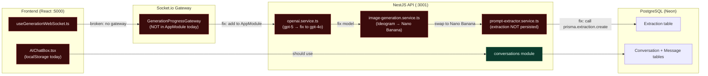

# EPIC-AI-00 — Foundation Fixes: Wire, Model, Persist

> **Phase:** Phase 0.5 — Foundation Repair (runs parallel to final 3 MVP human tasks)
> **Status:** 🔲 Not Started
> **Linear Project:** LIN-EPIC-AI-00
> **Target date:** 2026-05-12
> **Owner:** Dinesh

---

## Goal

**Outcome:** The 6 critical defects preventing the product from functioning are fixed — Socket.io progress appears in the browser, AI uses the correct model, Nano Banana replaces Ideogram across all tiers, extraction data persists to the database, and conversation history survives a page refresh.

**Why now:** These are pre-conditions, not features. Without them, every downstream AI capability (EPIC-AI-01+) is built on a broken foundation. They can be implemented in parallel while the human completes the 3 remaining MVP human tasks (critical-path test → staging → prod go-live).

**Success metric:** Socket.io progress events visible in browser network tab. Conversations load from backend after hard refresh. Extraction records visible in Prisma Studio after generation. `gpt-4o` appears in OpenAI dashboard logs (not `gpt-5`). Image generation cost reduced by ≥70% on SOLO/FREE tier.

---

## Milestones

| Milestone | Scope | Target | Status |
|-----------|-------|--------|--------|
| [M-AI-01-critical-fixes](milestones/M-AI-01-critical-fixes.md) | Wire Socket.io gateway + fix GPT model ID | 2026-05-05 | 🔲 |
| [M-AI-02-model-swap](milestones/M-AI-02-model-swap.md) | Replace Ideogram with Nano Banana Flash + Pro | 2026-05-08 | 🔲 |
| [M-AI-03-data-persistence](milestones/M-AI-03-data-persistence.md) | Persist extraction to DB + connect conversations to backend | 2026-05-12 | 🔲 |

---

## Stories in this Epic

| Story ID | Title | Milestone | Status | PR |
|----------|-------|-----------|--------|----|
| [US-AI-001](stories/US-AI-001/STORY.md) | Wire Socket.io Gateway to AppModule | M-AI-01 | 🔲 | — |
| [US-AI-002](stories/US-AI-002/STORY.md) | Fix GPT model ID: gpt-5 → gpt-4o | M-AI-01 | 🔲 | — |
| [US-AI-002a](stories/US-AI-002a/STORY.md) | Brand color hex codes → descriptive names in image prompt | M-AI-01 | 🔲 | — |
| [US-AI-003](stories/US-AI-003/STORY.md) | Replace Ideogram Turbo with Nano Banana Flash (FREE/SOLO) | M-AI-02 | 🔲 | — |
| [US-AI-004](stories/US-AI-004/STORY.md) | Replace Ideogram V2 with Nano Banana Pro (TEAM/BROKERAGE) | M-AI-02 | 🔲 | — |
| [US-AI-005](stories/US-AI-005/STORY.md) | Persist Extraction data to database | M-AI-03 | 🔲 | — |
| [US-AI-006](stories/US-AI-006/STORY.md) | Connect conversations to backend API (remove localStorage) | M-AI-03 | 🔲 | — |

---

## Features in this Epic

| Feature ID | Scope | Stories |
|------------|-------|---------|
| F-AI-00-01 | Real-time generation progress via Socket.io | US-AI-001 |
| F-AI-00-02 | Correct LLM model routing (GPT-4o, Nano Banana) | US-AI-002, US-AI-003, US-AI-004 |
| F-AI-00-03 | Durable data persistence (extraction + conversations) | US-AI-005, US-AI-006 |

---

## Out of Scope (Epic Level)

- Conversational AI responses (EPIC-AI-01)
- Any new UI components or feature additions
- Lovart-inspired UX patterns
- Changes to business logic beyond model swaps and data wiring
- Stripe or payment changes

---

## Definition of Done (Epic)

- [ ] All 3 milestones closed
- [ ] All 6 stories have PR merged and STORY.md status = ✅ Done
- [ ] Socket.io progress events visible in browser (network WS tab) during generation
- [ ] `openai.service.ts` uses `gpt-4o` — verified in OpenAI dashboard logs
- [ ] Nano Banana Flash is called for FREE/SOLO; Nano Banana Pro for TEAM/BROKERAGE
- [ ] Extraction records present in DB after generation (check via Prisma Studio)
- [ ] Conversations load from `/api/v1/conversations` after page refresh (localStorage no longer used)
- [ ] `npm run check` + `npm run test:unit` passing
- [ ] AGILE_INDEX.md epic row updated to ✅ Done

---

## Architecture Notes

See [ARCHITECTURE.mmd](./ARCHITECTURE.mmd).



Key files relevant to this epic:
```
- api/src/app.module.ts
- api/src/modules/ai-generation/gateways/generation-progress.gateway.ts
- api/src/modules/ai-generation/services/openai.service.ts
- api/src/modules/ai-generation/services/image-generation.service.ts
- api/src/config/ai-models.config.ts
- api/src/modules/infographics/services/prompt-extractor.service.ts
- client/src/components/ai-chat/AIChatBox.tsx
- client/src/lib/api.ts
```

---

*Epic created: 2026-04-28 | Last updated: 2026-04-28*
