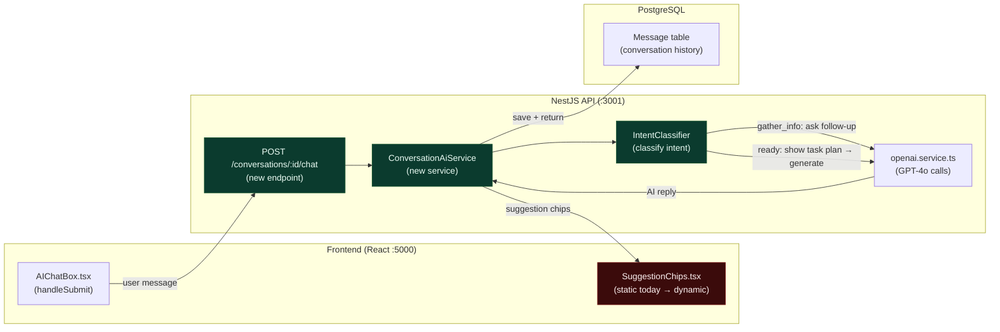

# EPIC-AI-01 — Conversational AI Core

> **Phase:** Phase 1 — Conversational AI (Month 1–3)
> **Status:** 🔲 Not Started
> **Depends on:** EPIC-AI-00 complete (all 6 foundation fixes)
> **Linear Project:** LIN-EPIC-AI-01
> **Target date:** 2026-07-31
> **Owner:** Dinesh

---

## Goal

**Outcome:** The product transforms from "image generator with a chat wrapper" into a genuine AI assistant — it asks follow-up questions, classifies intent, shows a task plan before generating, and surfaces contextual suggestion chips after every response.

**Why now:** This is the product promise. Without it, the AI Chat is just a form with a Submit button. EPIC-AI-01 is what agents are willing to pay for. Expected SOLO conversion rate increase: <1% → 5–8%.

**Success metric:** A user can have a 5-turn conversation (with follow-up questions from the AI) and reach generation without a single regex validation error. Pre-generation plan appears before image generation starts. 3 contextual suggestion chips appear after every AI response.

---

## Milestones

| Milestone | Scope | Target | Status |
|-----------|-------|--------|--------|
| [M-AI-04-conversational-core](milestones/M-AI-04-conversational-core.md) | ConversationAiService + intent classification + pre-generation plan | 2026-06-30 | 🔲 |
| [M-AI-05-suggestion-chips](milestones/M-AI-05-suggestion-chips.md) | AI-generated context-aware suggestion chips | 2026-07-31 | 🔲 |

---

## Stories in this Epic

| Story ID | Title | Milestone | Status | PR |
|----------|-------|-----------|--------|----|
| [US-AI-007](stories/US-AI-007/STORY.md) | ConversationAiService + Intent Classification (CAP-01, CAP-02) | M-AI-04 | 🔲 | — |
| [US-AI-008](stories/US-AI-008/STORY.md) | Pre-generation task plan message (CAP-04) | M-AI-04 | 🔲 | — |
| [US-AI-009](stories/US-AI-009/STORY.md) | AI-generated suggestion chips (CAP-05) | M-AI-05 | 🔲 | — |

---

## Features in this Epic

| Feature ID | Scope | Stories |
|------------|-------|---------|
| F-AI-01-01 | Conversational AI core — replies, intent routing | US-AI-007 |
| F-AI-01-02 | Pre-generation transparency — task plan message | US-AI-008 |
| F-AI-01-03 | Dynamic suggestion chips — context-aware, AI-generated | US-AI-009 |

---

## Out of Scope (Epic Level)

- Property photo upload (EPIC-AI-02 — CAP-06)
- Output format selector (EPIC-AI-02 — CAP-07)
- Quality tiers and model routing (EPIC-AI-02 — CAP-08, CAP-09)
- Campaign Mode (EPIC-AI-02 — CAP-10)
- Any editing / refinement features (EPIC-AI-03+)
- Backend AI response changes to the image generation prompt itself

---

## Definition of Done (Epic)

- [ ] All milestones closed
- [ ] All stories have PR merged and STORY.md status = ✅ Done
- [ ] AI sends a conversational reply to every user message (no silent validation loops)
- [ ] Intent classification routes to `gather_info`, `ready`, `refine`, or `campaign` correctly
- [ ] Pre-generation task plan message appears in chat before image generation starts
- [ ] 3 contextual suggestion chips appear after every AI response (not static hardcoded list)
- [ ] `npm run check` + `npm run test:unit` passing
- [ ] AGILE_INDEX.md epic row updated to ✅ Done

---

## Architecture Notes

See [ARCHITECTURE.mmd](./ARCHITECTURE.mmd).



Key files relevant to this epic:
```
- api/src/modules/conversations/conversations.module.ts
- api/src/modules/conversations/conversations.controller.ts
- api/src/modules/ai-generation/services/openai.service.ts
- client/src/components/ai-chat/AIChatBox.tsx
- client/src/components/ai-chat/promptSuggestionsData.ts
- client/src/lib/api.ts
```

---

*Epic created: 2026-04-28 | Last updated: 2026-04-28*
