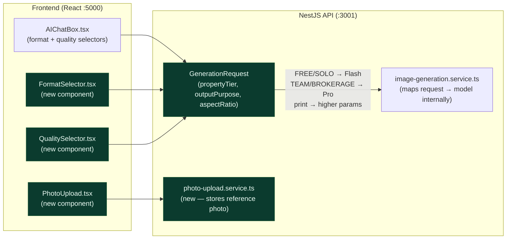

# EPIC-AI-02 — Generation Control

> **Phase:** Phase 1 — Conversational AI (Month 1–3, parallel with EPIC-AI-01)
> **Status:** 🔲 Not Started
> **Depends on:** EPIC-AI-00 complete
> **Linear Project:** LIN-EPIC-AI-02
> **Target date:** 2026-07-31
> **Owner:** Dinesh

---

## Goal

**Outcome:** Agents control what gets generated — they can upload their own listing photos, choose the output format (Instagram/Facebook/Story/Print), pick quality based on use case (social vs. print), and toggle Campaign Mode in the UI. All model selection happens invisibly based on tier and use case.

**Why now:** These controls are what differentiate a real estate AI tool from a generic image generator. Providing format and quality choice without exposing underlying models is a key product principle.

**Success metric:** Instagram Square (1:1) and Print (4:3) formats generate correctly. Property photos appear in the generated infographic. Quality selector shows "Social" and "Print" (not resolution numbers or model names). Campaign Mode UI toggle exists (backend deferred to EPIC-AI-04).

---

## Milestones

| Milestone | Scope | Target | Status |
|-----------|-------|--------|--------|
| [M-AI-06-photo-and-format](milestones/M-AI-06-photo-and-format.md) | Property photo upload + output format selector | 2026-06-30 | 🔲 |
| [M-AI-07-quality-campaign](milestones/M-AI-07-quality-campaign.md) | Quality tiers + property routing + Campaign Mode UI | 2026-07-31 | 🔲 |

---

## Stories in this Epic

| Story ID | Title | Milestone | Status | PR |
|----------|-------|-----------|--------|----|
| [US-AI-010](stories/US-AI-010/STORY.md) | Property photo upload + reference in generation (CAP-06) | M-AI-06 | 🔲 | — |
| [US-AI-011](stories/US-AI-011/STORY.md) | Output format selector: Instagram/Facebook/Story/Print (CAP-07) | M-AI-06 | 🔲 | — |
| [US-PANEL-01](stories/US-PANEL-01/STORY.md) | Right Panel: Brand Styles → Generation + Quick Styles as post-generation tool | M-AI-06 | 🔲 | — |
| [US-AI-012](stories/US-AI-012/STORY.md) | Generation quality tiers: Social vs Print (CAP-08) | M-AI-07 | 🔲 | — |
| [US-AI-013](stories/US-AI-013/STORY.md) | Property type → quality routing (CAP-09, hidden internal logic) | M-AI-07 | 🔲 | — |
| [US-AI-014](stories/US-AI-014/STORY.md) | Campaign Mode UI toggle (CAP-10, backend deferred) | M-AI-07 | 🔲 | — |

---

## Features in this Epic

| Feature ID | Scope | Stories |
|------------|-------|---------|
| F-AI-02-01 | Property photo upload and reference | US-AI-010 |
| F-AI-02-02 | Multi-platform output format selector | US-AI-011 |
| F-AI-02-03 | Quality tier selector (model-transparent) | US-AI-012, US-AI-013 |
| F-AI-02-04 | Campaign Mode UI framing | US-AI-014 |

---

## Out of Scope (Epic Level)

- Campaign Mode backend / 4-piece generation (EPIC-AI-04 — CAP-09 backend)
- Background removal from photos (EPIC-AI-03 — CAP-16)
- Upscaling to print quality (EPIC-AI-03 — CAP-17)
- Exposing model names to users (strictly forbidden — see model opacity principle)

---

## Definition of Done (Epic)

- [ ] All milestones closed
- [ ] All stories have PR merged and STORY.md status = ✅ Done
- [ ] Property photo appears in generated infographic
- [ ] Instagram Square and Print format produce correctly sized outputs
- [ ] Quality selector shows "Social" and "Print" labels (no model names or resolution numbers)
- [ ] Campaign Mode UI toggle exists but shows "Coming Soon" state for backend
- [ ] `npm run check` + `npm run test:unit` passing
- [ ] AGILE_INDEX.md epic row updated to ✅ Done

---

## Architecture Notes

See [ARCHITECTURE.mmd](./ARCHITECTURE.mmd).



Key files relevant to this epic:
```
- client/src/components/ai-chat/AIChatBox.tsx
- api/src/modules/ai-generation/services/image-generation.service.ts
- api/src/modules/infographics/services/infographics.service.ts
- api/src/config/ai-models.config.ts
```

---

*Epic created: 2026-04-28 | Last updated: 2026-04-28*
