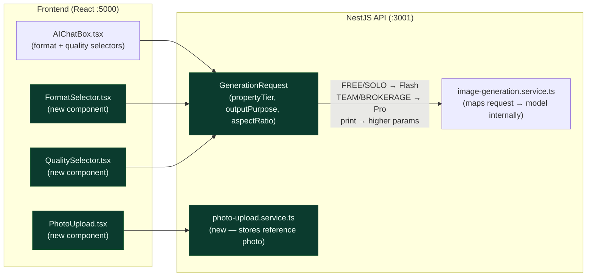

# EPIC-AI-02 — Generation Control

> **Phase:** Phase 1 — Revenue Strategy
> **Priority note (2026-07-03):** US-AI-010 (photo upload) and US-AI-011 (format selector) are hard dependencies of the promoted revenue epics — implement these two FIRST. US-PANEL-01 is deprioritized behind EPIC-AI-06 and EPIC-KIT-01.
> **Scope note (2026-07-30):** US-AI-012/013/014 (quality tiers + Campaign Mode UI) moved to [EPIC-AI-08](../../phase-4-backlog/EPIC-AI-08/EPIC.md) in Phase 4 Backlog — revenue-gated, not a launch blocker.
> **Status:** 🟡 In Progress — US-AI-010/036/037/038 implementation complete (pre-PR, not yet closed); US-AI-011 superseded; US-PANEL-01 Not Started
> **Depends on:** EPIC-AI-00 complete
> **Linear Project:** LIN-EPIC-AI-02
> **Target date:** 2026-07-31
> **Owner:** Dinesh

---

## Goal

**Outcome:** Agents control what gets generated — they can upload their own listing photos, choose the output format (Instagram/Facebook/Story/Print), pick quality based on use case (social vs. print), and toggle Campaign Mode in the UI. All model selection happens invisibly based on tier and use case.

**Why now:** These controls are what differentiate a real estate AI tool from a generic image generator. Providing format and quality choice without exposing underlying models is a key product principle.

**Success metric:** Instagram Square (1:1) and Print (4:3) formats generate correctly. Property photos appear in the generated infographic. Quality selector shows "Social" and "Print" (not resolution numbers or model names). Campaign Mode UI toggle exists (backend deferred to EPIC-AI-04).

---

## Milestones

| Milestone | Scope | Target | Status |
|-----------|-------|--------|--------|
| [M-AI-06-photo-and-format](milestones/M-AI-06-photo-and-format.md) | Property photo upload + output format selector | 2026-06-30 | 🔲 |
| ~~M-AI-07-quality-campaign~~ | Moved to [EPIC-AI-08](../../phase-4-backlog/EPIC-AI-08/EPIC.md) (Phase 4 Backlog, revenue-gated) | — | ⏸ Moved |

---

## Stories in this Epic

| Story ID | Title | Milestone | Status | PR |
|----------|-------|-----------|--------|----|
| [US-AI-010](stories/US-AI-010/STORY.md) | Property photo upload + reference in generation (CAP-06) | M-AI-06 | 🟡 Implementation Complete (pre-PR) | — |
| [US-AI-011](stories/US-AI-011/STORY.md) | ~~Output format selector: Instagram/Facebook/Story/Print (CAP-07)~~ | M-AI-06 | ⏭️ Superseded | — |
| [US-AI-036](stories/US-AI-036/STORY.md) | Canvas-aware generation orientation (replaces US-AI-011, part 1) | M-AI-06 | 🟡 Implementation Complete (pre-PR) | — |
| [US-AI-037](stories/US-AI-037/STORY.md) | Save as Template — personal library (replaces US-AI-011, part 2) | M-AI-06 | 🟡 Implementation Complete (pre-PR) | — |
| [US-AI-038](stories/US-AI-038/STORY.md) | Format Picker — New Design / New Template (replaces US-AI-011, part 3) | M-AI-06 | 🟡 Implementation Complete (pre-PR) | — |
| [US-AI-039](stories/US-AI-039/STORY.md) | Format Picker — Canva-style single-modal reorg (category rail + inline library) | M-AI-06 | 🟡 Implementation Complete (pre-PR) | — |
| [US-AI-040](stories/US-AI-040/STORY.md) | Template Gallery — preview modal + tag-based filters | M-AI-06 | 🟡 Implementation Complete (pre-PR) | — |
| [US-AI-041](stories/US-AI-041/STORY.md) | ~~Format Picker — device-mockup preview for social formats~~ | M-AI-06 | ⏭️ Superseded | — |
| [US-AI-042](stories/US-AI-042/STORY.md) | Real canvas thumbnails on save | M-AI-06 | 🟡 Implementation Complete (pre-PR) | — |
| [US-PANEL-01](stories/US-PANEL-01/STORY.md) | Right Panel: Brand Styles → Generation + Quick Styles as post-generation tool | M-AI-06 | 🔲 | — |
| [US-AI-012](../../phase-4-backlog/EPIC-AI-08/stories/US-AI-012/STORY.md) | Generation quality tiers: Social vs Print (CAP-08) — moved to EPIC-AI-08 | M-AI-07 | ⏸ Moved | — |
| [US-AI-013](../../phase-4-backlog/EPIC-AI-08/stories/US-AI-013/STORY.md) | Property type → quality routing (CAP-09) — moved to EPIC-AI-08 | M-AI-07 | ⏸ Moved | — |
| [US-AI-014](../../phase-4-backlog/EPIC-AI-08/stories/US-AI-014/STORY.md) | Campaign Mode UI toggle (CAP-10) — moved to EPIC-AI-08 | M-AI-07 | ⏸ Moved | — |

---

## Features in this Epic

| Feature ID | Scope | Stories |
|------------|-------|---------|
| F-AI-02-01 | Property photo upload and reference | US-AI-010 |
| F-AI-02-02 | ~~Multi-platform output format selector~~ (superseded) | US-AI-011 |
| F-AI-02-03 | ~~Quality tier selector (model-transparent)~~ (moved to EPIC-AI-08) | US-AI-012, US-AI-013 |
| F-AI-02-04 | ~~Campaign Mode UI framing~~ (moved to EPIC-AI-08) | US-AI-014 |
| F-AI-02-05 | Canvas-aware generation orientation | US-AI-036 |
| F-AI-02-06 | Save as Template (personal library) + premium-template DB migration | US-AI-037 |
| F-AI-02-07 | Format Picker (New Design / New Template) | US-AI-038, US-AI-039, ~~US-AI-041~~ (superseded) |
| F-AI-02-08 | Template Gallery — preview modal + tag-based filters | US-AI-040 |
| F-AI-02-09 | Real canvas thumbnails on save | US-AI-042 |

---

## Implementation Sequencing (2026-07-29)

Originally two parallel tracks; **Track A retired 2026-07-30** — its only story, US-AI-012, moved to [EPIC-AI-08](../../phase-4-backlog/EPIC-AI-08/EPIC.md) (Phase 4 Backlog, revenue-gated). The cross-track file collision on `AIChatBox.tsx` noted below no longer applies since Track A no longer runs here.

**Track B — Canvas/template workflow** (`US-AI-036 ∥ US-AI-037 → US-AI-038`) — active
| Step | Story | Action | Note |
|---|---|---|---|
| B1 | US-AI-036 | `harden` → `implement-story` → `test-story` | Size M (~5h) — smallest, file-disjoint from 037 |
| B2 | US-AI-037 | `harden` → `implement-story` → `test-story` | Size L (~12-14h, 3 sessions) — longest pole, start as early as possible so it doesn't gate US-AI-038 |
| B3 | US-AI-038 | `harden` (safe anytime) → `implement-story` only after US-AI-037 merges | Hard dependency — Library step has nothing real to browse until 037 ships |

**Effort:** Track B ≈ 26-29.5h (037 is the long pole). All three (036/037/038) are implementation-complete pre-PR as of 2026-07-29.

---

## Out of Scope (Epic Level)

- Quality tier selector + Campaign Mode UI (moved to EPIC-AI-08, Phase 4 Backlog — revenue-gated, 2026-07-30)
- Campaign Mode backend / 4-piece generation (EPIC-AI-04 — CAP-09 backend)
- Background removal from photos (EPIC-AI-03 — CAP-16)
- Upscaling to print quality (EPIC-AI-03 — CAP-17)
- Exposing model names to users (strictly forbidden — see model opacity principle)

---

## Definition of Done (Epic)

- [ ] All milestones closed (M-AI-07 excluded — moved to EPIC-AI-08)
- [ ] All stories have PR merged and STORY.md status = ✅ Done
- [ ] Property photo appears in generated infographic
- [ ] Instagram Square and Print format produce correctly sized outputs
- [ ] `npm run check` + `npm run test:unit` passing
- [ ] AGILE_INDEX.md epic row updated to ✅ Done

---

## Architecture Notes

See [ARCHITECTURE.mmd](./ARCHITECTURE.mmd).


```mermaid
flowchart LR
  subgraph Frontend["Frontend (React :5000)"]
    A["AIChatBox.tsx\n(format + quality selectors)"]
    B["PhotoUpload.tsx\n(new component)"]:::good
    C["FormatSelector.tsx\n(new component)"]:::good
    D["QualitySelector.tsx\n(new component)"]:::good
  end
  subgraph NestJS["NestJS API (:3001)"]
    E["GenerationRequest\n(propertyTier, outputPurpose, aspectRatio)"]:::good
    F["image-generation.service.ts\n(maps request → model internally)"]
    G["photo-upload.service.ts\n(new — stores reference photo)"]:::good
  end
  A --> E
  B --> G
  C --> E
  D --> E
  E -- "FREE/SOLO → Flash\nTEAM/BROKERAGE → Pro\nprint → higher params" --> F
  classDef good fill:#0b3b2e,stroke:#14532d,color:#ecfdf5;
```

Key files relevant to this epic:
```
- client/src/components/ai-chat/AIChatBox.tsx
- api/src/modules/ai-generation/services/image-generation.service.ts
- api/src/modules/infographics/services/infographics.service.ts
- api/src/config/ai-models.config.ts
```

---

---

## Implementation Update (log)

### 2026-07-31 — US-AI-039 implementation complete (pre-PR)
- **Files touched:** `client/src/components/pages/FormatPickerDialog.tsx` (rewrite), `e2e/us-ai-039-format-picker-reorg.spec.ts` (new)
- **ACs covered:** AC1, AC2, AC3, AC4, AC5, AC6, AC7, AC8, AC9, AC10, AC11 — all 11 ACs covered by the implementation; AC9 and TC-AI-039-01 through TC-AI-039-04 deferred to manual E2E run (requires fresh `npm run dev` — Playwright `reuseExistingServer:true` reused the old server during automated run, which showed the pre-reorg UI)
- **Commits:** 2 on branch `feat/ai-us-ai-039-format-picker-reorg`
- **Notes:** T1-T4 combined into one commit (all in FormatPickerDialog.tsx). The `step` state machine and `ChevronLeft` import were removed; `getPlatformForFormat()` helper added to walk FORMAT_TAXONOMY for AC5 pre-selection. Library fetch effect now depends on `[selectedFormatId, activeCategory]` instead of `[step, selectedFormatId]`. `p-0` on DialogContent required to manage two-pane layout (header border + side-by-side panes). E2E spec (T5) typechecks clean but requires a fresh dev server start before running; add note to PR description.

### 2026-07-29 — US-AI-038 implementation complete (pre-PR)
- **Files touched:** `client/src/lib/formatTaxonomy.ts` (new), `client/src/components/pages/FormatPickerDialog.tsx` (new), `client/src/lib/api.ts` (added `getByFormatTag`), `client/src/lib/storage.ts` (added `getLastFormat`/`setLastFormat`), `client/src/App.tsx` (wired both page wrappers to open picker), `client/src/lib/starterCanvasTemplates.ts` (added `platformTag` field to interface)
- **ACs covered:** AC1, AC2, AC3, AC5, AC6, AC7, AC8, AC9, AC10 (AC4 deferred to /test-story — requires saved templates in a running session)
- **Commits:** 4 on branch `feat/ai-us-ai-038-format-picker`
- **Notes:** T2 and T3 were implemented together in a single FormatPickerDialog.tsx commit (both steps built in one pass). T5 scope drift: `premiumTemplates.ts` was deleted by US-AI-037; the 5 admin_curated premium templates now live in the DB and need a DB seed/migration update to receive platform tags — this requires a backend script change outside the frontend scope of this story. The `platformTag` field was added to the `StarterCanvasTemplate` TS interface so future static starters can declare their format. "New Template" entry: the TemplatesPage "Create Blank" callback is now intercepted in App.tsx to open the Format Picker; button label rename ("Create Blank" → "New Template") is a cosmetic follow-up requiring TemplatesPage.tsx (not in scope). Canvas dimensions for "Start Blank" are applied to the Zustand store before SPA navigation — no EditorLayout.tsx changes needed.

### 2026-07-29 — US-AI-037 implementation complete (pre-PR)
- **Files touched:** `api/src/modules/designs/dto/create-design.dto.ts`, `api/src/modules/designs/services/designs.service.ts`, `api/src/modules/designs/controllers/canvas-templates.controller.ts`, `api/tests/designs/designs.service.spec.ts` (new), `client/src/lib/api.ts`, `client/src/components/editor/EditorToolbar.tsx`, `client/src/components/editor/EditorLayout.tsx`, `client/src/components/pages/TemplatesPage.tsx`, `api/scripts/seed-premium-templates.ts` (new), `client/src/lib/premiumTemplates.ts` (deleted), `client/src/lib/galleryTemplateCatalog.ts` (scope drift — required for deletion)
- **ACs covered:** AC1, AC2, AC3, AC6, AC7, AC9, AC11 (AC4, AC5, AC8, AC10 deferred to /test-story — require live runtime or live DB)
- **Commits:** 8 on branch `feat/ai-us-ai-037-save-as-template`
- **Notes:** `galleryTemplateCatalog.ts` was edited outside TASKS.md primary files (scope drift) because deleting `premiumTemplates.ts` would have left a broken import — mechanically necessary. Migration script (`seed-premium-templates.ts`) typechecks cleanly but requires a live DB to actually execute; AC8 is deferred until /test-story runs it against a real Neon connection. Admin_curated templates now have DB-generated IDs (not the static `premium_001` etc. IDs from the old static array) — `galleryTemplateCatalog.ts` no longer includes them in `GALLERY_BY_ID`, which is correct since those IDs are no longer the canonical identifiers.

*Epic created: 2026-04-28 | Last updated: 2026-07-29*
