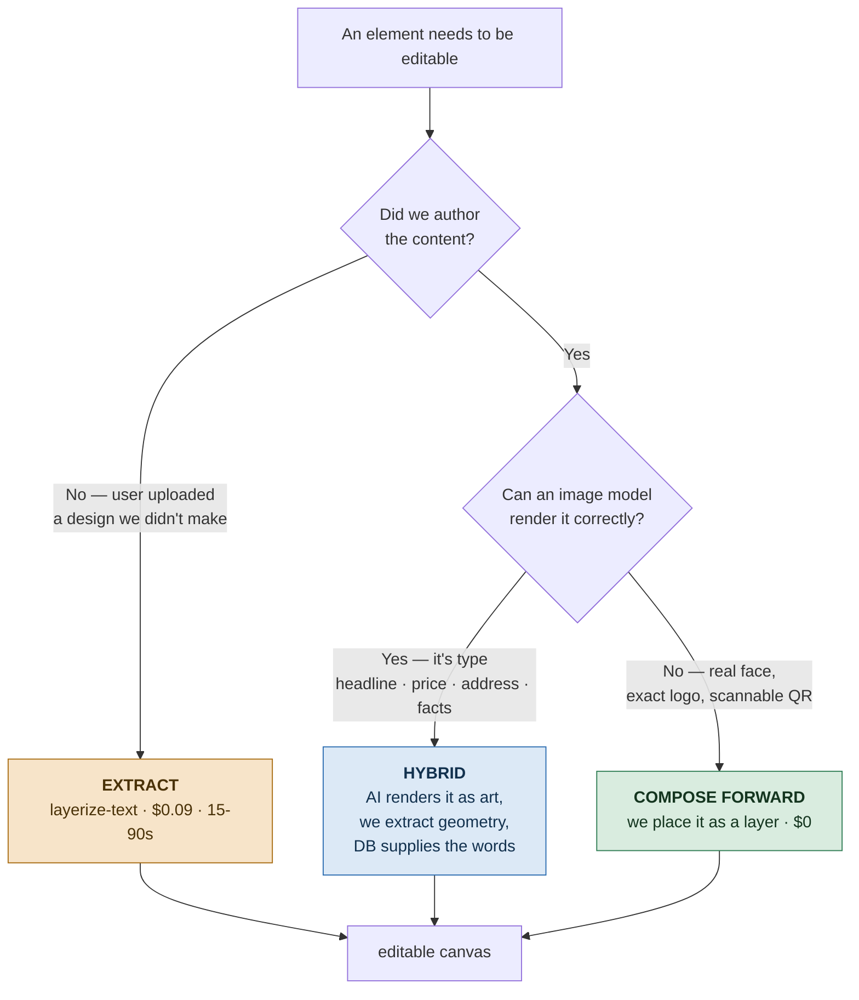

# M-EDIT-02-brand-layers — Brand Assets as Canvas Layers

> **Epic:** [EPIC-EDIT-03](../EPIC.md)
> **Status:** 🔲 Not Started
> **Target date:** TBD — scheduled on effort/sensitivity, see §Effort
> **Branch:** `feat/edit/m-02-brand-layers`
> **Source:** [PRD findings 2026-08-26](../../../../PRD/2026-08-26-compose-forward-findings.md)

---

## Goal

An agent's own brand furniture — brokerage logo, licence number, headshot, QR code — appears on
the generated design as **real, editable canvas layers**, placed by us rather than hoped for from
the image model.

---

## Why this, and why now

Verified 2026-08-26 against `infographic-prompt.builder.ts`:

| Element | In the image prompt? |
|---|---|
| Headline, price, address, facts | **yes** — rendered as art |
| Agent name, brokerage | **yes** — as text |
| Brokerage logo | **no** |
| Agent headshot | **no** |
| QR code, licence # | **no** |

Brand furniture is **not baked into the raster — it is absent from the product entirely.**
`useAgentStore` already holds `license` and `logoPreview`; neither ever reaches the canvas.

That is what makes this milestone unusually safe: **it competes with nothing.** Every other
proposal in this area trades AI-composed typography for engine-placed text and risks the output
looking worse. This one only adds elements the model never attempted — and structurally cannot
attempt, since an image model cannot render a real person's face or a scannable QR code.

---

## Which mechanism, when

Three routes to an editable element. They are not alternatives to choose between once — each owns
a different case.

### Use cases

| Mechanism | Used when | Example | Cost | Status |
|---|---|---|:--:|---|
| **Hybrid** *(default today)* | We authored the content **and** the model renders it well | Headline, price, address, beds/baths — typography integrated with the photo | $0.09 once, cached | ✅ shipped |
| **Compose forward** | We authored it **and** the model cannot render it correctly | Brokerage logo, agent headshot, QR code, licence # | $0 | 🔲 **this milestone** |
| **Extract** *(pure)* | We did **not** author the content | A flyer the user uploaded; a legacy design with no canonical values behind it | $0.09 once, cached | ✅ shipped |

The rule in one line: **the model owns typography; we own identity.**

### Why not compose-forward everything

Evaluated and rejected 2026-08-26 — see the
[findings doc](../../../../PRD/2026-08-26-compose-forward-findings.md). Two reasons:

1. **Accuracy was never the problem.** `text-block.mapper.ts:13` — canonical values are never
   sourced from model output. OCR supplies geometry; the database supplies the words. The
   accuracy argument for migrating wholesale does not exist.
2. **We would be trading model-composed typography for three layout templates.** The aesthetic
   downside is the hardest thing to reverse once users have seen it.

---

## Stories in this Milestone

| Order | Story | Title | Size | Blocked By | Status | PR |
|:-----:|-------|-------|:----:|------------|:------:|:--:|
| 1 | [US-EDIT-006](../stories/US-EDIT-006/STORY.md) | Brand layers from existing data — logo + licence | M | — | 🔲 | — |
| 2 | [US-EDIT-007](../stories/US-EDIT-007/STORY.md) | Agent headshot + QR code | M | US-EDIT-006 | 🔲 | — |

Split at the **data boundary**, not the component boundary: US-EDIT-006 builds the image-slot
mechanism and proves it against data that already exists (`logoPreview`, `license`). US-EDIT-007
adds the two assets that need new capture or generation, reusing that mechanism.

---

## Effort and sensitivity

Recorded so this can be scheduled rather than guessed at.

| Story | Effort | Sensitivity | Notes |
|---|:--:|:--:|---|
| US-EDIT-006 | **M** | **Low** | Purely additive. Touches no generation prompt, no extraction, no credit path. Worst realistic failure is a logo in the wrong place — visible, local, and trivially reversible. |
| US-EDIT-007 | **M** | **Medium** | Adds file upload + persistence for a headshot (new storage surface) and a QR dependency. Upload is the sensitive part, not the placement. |

**Neither story touches money.** No compose call, no credit metering, no plan gating — that whole
surface is untouched, which is what makes this schedulable independently of the payments work.

---

## Acceptance (Milestone Done When…)

- [ ] An agent with a saved logo sees it on a generated design without any manual step
- [ ] Every brand element placed is a **real, selectable, movable canvas layer** — never baked
      into the background raster
- [ ] Nothing is placed for an asset the agent has not supplied — no placeholder logos, no
      generic avatar, no dead QR
- [ ] Brand placement runs at generation time and costs **$0** — no `/compose` call involved
- [ ] Existing extraction behaviour is provably unchanged (US-EDIT-005's live spec still passes)
- [ ] All stories above have status ✅ Done
- [ ] Verification gates pass (Gate 1 mandatory)

---

## Notes / Blockers

- **Placement is the open design question.** The AI composes the full frame, so there is no
  reserved empty space for a logo. Options: a safe-margin heuristic (corner + padding), or wiring
  `LayoutPlannerService.planLayout()` (US-AI-044 — built, 49 tests, module-registered,
  **never invoked**) to find low-detail regions. The planner is the better answer and this is its
  natural first job; the heuristic is the fallback if wiring proves large. Decide in US-EDIT-006
  T1, do not let it expand the story.
- `brandColors` already exists on `AgentInfo` and is unused on the canvas — related, but a
  separate concern (palette, not layers). Out of scope here.
- No `brandKit` persistence model exists; `logoPreview` lives in a client-side Zustand store, so
  it does not survive a different device. Durable brand storage is its own story, not this one.

---

*Milestone created: 2026-08-26*
