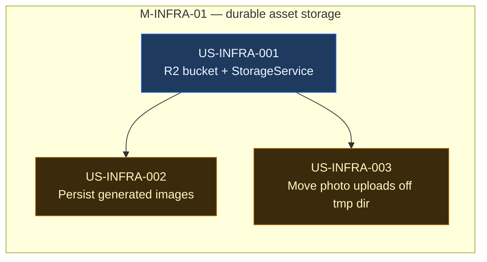

# EPIC-INFRA-02 — Durable Asset Storage

> **Phase:** Phase 1 — Revenue Strategy
> **Status:** 🔲 Not Started
> **Linear Project:** LIN-EPIC-XXX
> **Target date:** before US-LAUNCH-005 AC6 (real ₹ transaction)
> **Owner:** Dinesh
>
> ## 🚦 This epic is a revenue-on gate blocker
> `BETA_MODE=false` should not flip while paying customers' deliverables (generated infographics,
> editable-overlay compositions) live only on Ideogram's expiring, third-party-owned CDN URLs, and
> the source photos they upload for the real-photo pipeline survive only until the next Railway
> restart. This epic closes that gap. Unlike [EPIC-DEPLOY-01](../EPIC-DEPLOY-01/EPIC.md), it is
> **not** parallel/non-blocking — it ships before the revenue-on flip.

---

## Goal

**Outcome:** Every AI-generated infographic image, composed-design variant, and user-uploaded
source photo is copied into storage Buildographic owns — durable, highly available, and outside
any third-party provider's retention policy — the moment it's created.

**Why now:** Product audit (2026-08-19) found `Infographic.imageUrl` stores Ideogram's own CDN URL
directly — nothing is ever copied into owned storage. User-uploaded property photos land in
`os.tmpdir()/ai-infographic-uploads` on the NestJS container, wiped on every redeploy/restart. Both
are fine for a $0-revenue beta; neither is acceptable once real money changes hands for a
deliverable that can silently disappear.

**Success metric:** A generated infographic's image survives an Ideogram URL expiring/rotating.
A source-photo upload survives a mid-generation Railway redeploy. Both verified end-to-end on
staging.

---

## Root Cause / Pre-Story Analysis

- **Observed problem:** `Infographic.imageUrl` (`api/prisma/schema.prisma:104`) is populated
  directly from `ideogram.service.ts`'s API response (`response.data?.data?.[0]?.url`) — an
  Ideogram-hosted, presumably time-limited URL. The `composedDesigns` JSON cache
  (`layer-extraction.service.ts`, US-AI-048) keys off the same external URL with `exp`/`sig`
  stripped — still points back at Ideogram, never at anything Buildographic owns. Uploaded photos
  (`infographics.controller.ts` `FileInterceptor('photo')`) write to
  `path.join(os.tmpdir(), 'ai-infographic-uploads')` — ephemeral container-local disk.
- **Underlying cause:** No object-storage integration was ever built. The generation pipeline was
  designed to be "good enough to demo," not to own the assets it produces.
- **Constraints we must respect:** Must not add new user-facing latency to generation (upload can
  happen async/best-effort after the image is already returned to the user). Must not break the
  existing `composedDesigns` cache-key scheme (US-AI-048) — the owned URL takes over as the cache
  key going forward, old entries keyed on Ideogram URLs age out naturally. Sister product
  LensDeliver already runs on Cloudflare R2 (FastAPI/Supabase/R2 stack) — reuse that operational
  pattern rather than introducing a third storage vendor.
- **What success looks like:** `Infographic.imageUrl` and everything in `composedDesigns` point at
  an owned domain (e.g. `assets.buildographic.com`), not `ideogram.ai`. Source photos survive a
  container restart for the duration of an in-flight generation.

---

## Storage Decision

**Cloudflare R2**, chosen over AWS S3, Backblaze B2, Supabase Storage, and Railway volumes.

| Option | Storage | Egress | HA | Verdict |
|---|---|---|---|---|
| **Cloudflare R2** | $0.015/GB-mo | **$0** (zero egress fee) | Multi-region replicated, S3-compatible API | ✅ Chosen |
| AWS S3 (+ CloudFront) | $0.023/GB-mo | $0.09/GB | 11-nines durability | Higher cost at scale; needs a separate CDN layer |
| Backblaze B2 | $0.005/GB-mo | Free only via Cloudflare pairing | Good | Cheapest raw storage, still need to wire a CDN |
| Supabase Storage | mid-tier | billed | Good | New vendor for no gain — DB is Neon/Prisma, not Supabase |
| Railway volume | included | N/A | ❌ single-region disk, no CDN | Fine for scratch space only, wrong tool for public assets |

Deciding factors: zero egress fee (this is an image-serving product — every view/export/download
would otherwise cost S3-style egress forever), S3-compatible API (`@aws-sdk/client-s3` drops in
with no new SDK), free tier (10 GB + 1M Class A / 10M Class B ops/mo — likely covers all of beta at
$0), automatic Cloudflare CDN on a custom domain, and direct operational precedent from LensDeliver.

---

## Features in this Epic

| Feature ID | Scope | Stories | Status |
|------------|-------|---------|:------:|
| F-INFRA-01 | R2-backed storage service + persistence of generated images | US-INFRA-001, US-INFRA-002 | 🔲 |
| F-INFRA-02 | Durable source-photo uploads | US-INFRA-003 | 🔲 |

---

## Milestones

| Milestone | Scope | Target | Status |
|-----------|-------|--------|:------:|
| [M-INFRA-01-durable-asset-storage](milestones/M-INFRA-01-durable-asset-storage.md) | R2 bucket + StorageService, generated-image persistence, source-photo durability | before US-LAUNCH-005 AC6 | 🔲 |

---

## Stories in this Epic

| Order | Story ID | Title | Feature | Milestone | Size | Blocked By | Status | PR |
|:-----:|----------|-------|---------|-----------|:----:|------------|:------:|:--:|
| 1 | [US-INFRA-001](stories/US-INFRA-001/STORY.md) | R2 bucket + StorageService | F-INFRA-01 | M-INFRA-01 | S | — | 🔲 | — |
| 2 | [US-INFRA-002](stories/US-INFRA-002/STORY.md) | Persist generated images to owned storage | F-INFRA-01 | M-INFRA-01 | M | US-INFRA-001 | 🔲 | — |
| 3 | [US-INFRA-003](stories/US-INFRA-003/STORY.md) | Move source-photo uploads off the ephemeral tmp dir | F-INFRA-02 | M-INFRA-01 | S | US-INFRA-001 | 🔲 | — |

---

## Story Dependency DAG

---

## Files touched (inventory)

| File / Module | Owner Story | Layer | Status |
|---------------|-------------|-------|:------:|
| `api/src/modules/storage/` (new module: `storage.service.ts`, `storage.module.ts`) | US-INFRA-001 | backend | 🔲 |
| `api/prisma/schema.prisma` (`Infographic.imageUrl` semantics; no column shape change) | US-INFRA-002 | backend | 🔲 |
| `api/src/modules/ai-generation/services/ideogram.service.ts` | US-INFRA-002 | backend | 🔲 |
| `api/src/modules/ai-generation/services/layer-extraction.service.ts` | US-INFRA-002 | backend | 🔲 |
| `api/src/modules/infographics/controllers/infographics.controller.ts` | US-INFRA-003 | backend | 🔲 |
| `.env.example`, Railway env vars (`R2_*`) | US-INFRA-001 | infra | 🔲 |

---

## Architecture Notes (inline)

- **Entry points:** `ideogram.service.ts` (generate/remix responses), `layer-extraction.service.ts`
  (composed-design cache writes, US-AI-048), `infographics.controller.ts` (`FileInterceptor('photo')`
  upload handler).
- **Key abstractions:** New `StorageService` (`api/src/modules/storage/`) wraps the S3-compatible R2
  client behind `upload(buffer, key): Promise<string>` / `getPublicUrl(key): string` — callers never
  touch the R2 SDK directly. `DatabaseModule`-style `@Global()` provider so any module can inject it.
- **Data contracts:** `Infographic.imageUrl` stays a `String` column — no schema migration. Its
  *meaning* changes from "Ideogram URL" to "owned R2 URL." The `composedDesigns` cache-key scheme
  (US-AI-048) is unaffected in shape; new writes key off the owned URL.
- **Patterns to follow:** Match the existing `PrismaService` singleton-injection pattern
  (`DatabaseModule` is `@Global()`) — do the same for `StorageService` so it isn't re-provided
  per-module. Keep provider-specific code (R2 client config) isolated in `storage.service.ts` so a
  future provider swap doesn't ripple through callers.
- **Token / config replacements:**
  | Token | Replaces | Where |
  |-------|----------|-------|
  | `R2_ACCOUNT_ID` / `R2_ACCESS_KEY_ID` / `R2_SECRET_ACCESS_KEY` / `R2_BUCKET_NAME` / `R2_PUBLIC_URL` | new env vars | Railway env vars + `.env.example` |

For the visual diagram see [ARCHITECTURE.mmd](./ARCHITECTURE.mmd).
For environment variables see [ENV.yaml](./ENV.yaml).

---

## Out of Scope (Epic Level)

- **Final canvas-editor exports** (`canvasExport.ts` `downloadCanvas()`) — currently pure
  client-side download, never touches the server. Persisting exports (for a future "download
  history" / asset library feature) is a separate, lower-urgency story — not a data-loss risk today
  since nothing server-side is lost.
- **Template preview images** (`Template.previewUrl`) — static/seed assets, not user-generated.
- **User avatar** (`User.avatarUrl`) — Google OAuth-provided URL, not an app upload.
- **Organization logo** (`Organization.logoUrl`) — schema field exists but no upload endpoint was
  found; out of scope until an upload flow exists.
- **Backfilling existing `Infographic` rows** whose `imageUrl` already points at Ideogram.
  **DECIDED 2026-08-31: those rows are accepted as lost. No backfill story will be written.**
  The product is pre-launch and unmarketed, so every affected row belongs to internal testing
  rather than a paying customer — there is nobody to lose a deliverable. Those URLs will rot on
  Ideogram's own schedule and the rows will render broken images; that is the accepted outcome.
  This closes what was previously an open silence ("a backfill story can follow if historical data
  turns out to matter") — it turned out not to matter, and saying so is cheaper than leaving the
  question open for someone to rediscover.
  **If this decision is ever revisited** — say a beta cohort's work becomes worth preserving —
  the reopening condition is real customer data existing before `US-INFRA-002` shipped, which is a
  fixed, checkable set: `SELECT count(*) FROM "Infographic" WHERE "imageUrl" LIKE '%ideogram.ai%'`.
- **Provider swap tooling / multi-provider abstraction** — one provider (R2), done cleanly, not a
  pluggable-storage-backend framework.

---

## Definition of Done (Epic)

- [ ] All milestones closed
- [ ] All stories have PR merged and STORY.md status = ✅ Done
- [ ] Verified on staging environment (an Ideogram-URL-expiry scenario and a mid-generation restart
      scenario are both exercised, not just happy-path)
- [ ] All verification gates pass (see PROJECT_CONTEXT.yaml.gates)
- [ ] PHASE_TRACKER.md updated — M-LAUNCH-02 revenue-on gate criteria note this epic as satisfied
- [ ] AGILE_INDEX.md epic row updated to ✅ Done

---

## Implementation Update (log)

### 2026-08-19 — Epic scaffolded
- **Trigger:** User asked where infographics/images are stored today; codebase audit found none of
  it is durable. Asset inventory, storage-provider analysis (R2 chosen), and epic/milestone/story
  scaffolding done in the same session.
- **Notes:** User confirmed via AskUserQuestion: new epic (not folded into EPIC-DEPLOY-01 or
  EPIC-LAUNCH-01), treated as a revenue-on gate blocker, and source-photo durability (US-INFRA-003)
  included in the same milestone rather than split off.

---

*Epic created: 2026-08-19 | Last updated: 2026-08-19*
