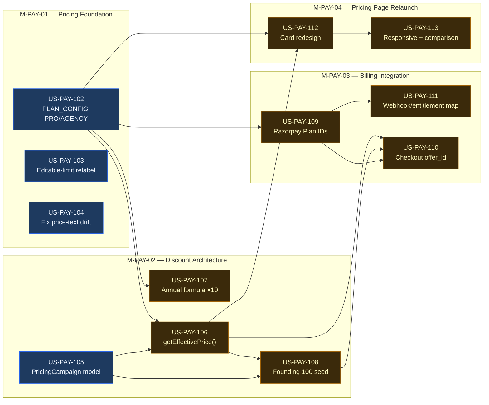

# EPIC-PAY-05 — Pricing Relaunch (Founding Customer Launch)

> **Phase:** Phase 1 — Revenue Strategy
> **Status:** 🔲 Not Started
> **Linear Project:** LIN-EPIC-XXX
> **Target date:** **V1** (6 stories, see Scope split below) before US-LAUNCH-005 AC6 (real ₹
> transaction) and before/alongside `BETA_MODE=false`. **V2** (6 stories) is explicitly decoupled
> from that gate — no target date yet, revisit once V1 has real transaction/demand data.
> **Owner:** Dinesh
> **Source:** [docs/agile/PRD/2026-08-21-pricing-relaunch.md](../../../PRD/2026-08-21-pricing-relaunch.md)
>
> **Naming note:** `EPIC-PAY-02` (payment-method UI), `EPIC-PAY-03` (Stripe activation), and
> `EPIC-PAY-04` (API-tier volume pricing) are pre-existing `PHASE_TRACKER.md` placeholders for
> distinct, later-phase work — none scaffolded. This epic does not touch or absorb them; it took the
> next free number per `PROJECT_CONTEXT.yaml`'s counter (`epic: 5`).

---

## Goal

**Outcome:** Beta pricing (₹2,999/₹6,999/₹24,999, no PRO or AGENCY tier) is replaced with a
feasibility-checked pricing model (Free/Solo/Pro/Team/Agency/Enterprise) that clears 75–80%
contribution margin under real cost data, launches with a time-boxed Founding Customer 100 program,
and is built so the *next* promotional campaign (festival, referral, …) is a database row and a few
Razorpay dashboard clicks — not a code change.

**Why now:** Product audit + same-session feasibility analysis (2026-08-21) found current live
pricing degrades to 52% typical / 8% worst-case margin once editable-design usage is real (already
measured and partially mitigated by `US-LAUNCH-015`, 2026-08-15). This epic is the actual pricing
fix that discovery pointed at — not speculative, a direct response to a measured problem. It also
lands before the revenue-on flip (`BETA_MODE=false`), which is gated on `EPIC-INFRA-02` and
`US-LAUNCH-005` AC6 — this epic should be ready before that transaction runs on the new prices, not
the old ones.

**Success metric:** A new signup on any paid tier sees the correct regular/founding price, checks
out via Razorpay with the discount applied server-side (never client-trusted), and the founding
program can be replaced by a festival campaign later with zero deploys — verified by actually
running that swap on staging.

---

## Root Cause / Pre-Story Analysis

- **Observed problem:** `shared/schema.ts` `PLAN_CONFIG` has no PRO or AGENCY tier, no founding-price
  concept, and no campaign mechanism at all. `PricingPage.tsx:468-469` also hardcodes literal price
  text independent of `PLAN_CONFIG` — already drifts from real config today, a pre-existing bug this
  epic fixes while it's in the file anyway.
- **Underlying cause:** Pricing was built for MVP beta (get *a* number live), not for a sustainable,
  promotable, multi-campaign SaaS model. No config axis exists for "time-boxed discount," so the
  original PRD's own suggested schema (`founding_enabled`, `founding_price` as plan columns) would
  have required a new column per future campaign — the same anti-pattern this epic exists to avoid.
- **Constraints we must respect:**
  - Razorpay is the only billing provider (no replacement) — extend `payments.service.ts`'s existing
    `RAZORPAY_PLAN_*` env var pattern, don't parallel-build.
  - Razorpay Subscription Plans are price-immutable once created — discounts must use Razorpay's
    `Offer`/`offer_id` mechanism (verified against live docs 2026-08-21:
    https://razorpay.com/docs/payments/subscriptions/offers/), not a new Plan per campaign.
  - `UsageLimitService` is already the centralized entitlement point — extend, don't parallel-build.
  - Product currently has **no paying customers** (beta) — clean migration, not legacy data
    preservation, is the priority (per original PRD instruction).
  - The editable-design credit mechanism this PRD originally specified conflicts with what actually
    shipped 6 days ago (`US-LAUNCH-015`) — resolved as an explicit decision below, not silently
    picked.
- **What success looks like:** Pricing page shows Free/Solo/Pro/Team/Agency/Enterprise with correct
  regular + founding prices; checkout charges the right amount; a second campaign can be launched
  without a code deploy; margin holds per the validated numbers below.

---

## Feasibility — validated this session, not just proposed

Full analysis: [docs/agile/PRD/2026-08-21-pricing-relaunch.md §2](../../../PRD/2026-08-21-pricing-relaunch.md).
Summary: verified against real code constants (Ideogram $0.06 generate / $0.09 editable, LLM $0.004
flat) and real production data (`UsageRecord` table, 107 real records, $0.1195/unit blended average;
live Railway metrics, <5% CPU/memory utilization confirming infra marginal cost is negligible at
current scale). **All 4 paid tiers clear 75–80% margin** at both 100%-utilization worst case
(90.3–91.5% regular / 86.8–89.1% founding) and realistic 60%/50%-utilization average case
(93.2–93.7%). This is a real fix to a measured problem (current Team margin: 52% typical / 8%
worst-case with editable usage), not a speculative price increase.

---

## Two decisions locked before story-writing (do not re-litigate in individual stories)

### 1. Campaigns vs. annual discount are two separate, independently-configured mechanisms

- **Campaigns** (Founding, festival, future) — `PricingCampaign` model, time-boxed, toggled,
  `isActive` (only one at a time), tied to Razorpay `Offer` objects. See F-PAY-02.
- **Annual discount** — a standing, always-on, ×10 (2-months-free) structural discount, same
  category as Claude/Cursor's annual pricing — never toggled, never expires, composes with whatever
  campaign is active. **Corrected 2026-08-21**: for `PERCENT`-type campaign discounts (the only
  type any campaign uses today, including Founding-100), composition order with the ×10 multiplier
  is mathematically irrelevant — both are multiplicative, and multiplication commutes
  (`549900 × 0.7273 × 10 == 549900 × 10 × 0.7273`). This isn't a product decision needing sign-off,
  it's arithmetic. It only becomes a real design question for a future `FLAT` (rupee-amount)
  campaign discount, which `US-PAY-106` explicitly rejects rather than silently mis-computing —
  see that story for the reasoning.
- **The original PRD's annual math had a labeling bug**: `₹5,499 × 12 →` is written but the shown
  figures (₹54,990 etc.) are actually `× 10`. Use `× 10` — verified: `5,499 × 10 = 54,990` ✓,
  `5,499 × 12 = 65,988` ✗. The current codebase's *existing* formula (`× 12 × 0.85`,
  `PricingPage.tsx:176-182`) is a third, different number — must be replaced, not left coexisting.

### 2. Editable-design limits — Path A (relabel), not the PRD's literal always-deducted model

The original PRD describes editable designs as a second, always-deducted quota. What's live today
(`US-LAUNCH-015`, `generations.service.ts:337-389`) is different: first compose per generation free
on paid tiers, only additional distinct-variation composes meter against the *shared* credit pool,
FREE gets a lifetime trial. **This epic keeps that mechanism and only changes its display** ("10
editable/month" becomes a UI-level allowance number, not a literal second counter) — the smaller,
lower-risk change that doesn't undo tested behavior. Reversing to the PRD's literal model (Path B)
was considered and explicitly not chosen; if that's wrong, say so before `US-PAY-103` is hardened.

---

## Scope split — V1 / V2 (decided 2026-08-22)

**Why:** This epic was reality-checked against actual product stage — the app has **zero paying
customers to date** and has not yet run its first real ₹ transaction (`US-LAUNCH-005` AC6, the last
open item before `BETA_MODE=false`). The original 12-story scope bundled a real, measured margin fix
(current Team margin degrades to 52%/8% once editable usage is real) together with a fully
generalized campaign/Offer engine built for a "next campaign" that doesn't exist yet, and a page
redesign whose per-tier feature content isn't captured in any durable file. Splitting avoids gating
the product's very first real transaction on 12 stories' worth of unproven new infrastructure.

### V1 — ship before/alongside the first real ₹ transaction

| Story | What it does | Depends on |
|---|---|---|
| US-PAY-104 | Fix hardcoded price-text drift in `PricingPage.tsx` | — |
| US-PAY-102 | Extend `PLAN_CONFIG` + Prisma enum with PRO/AGENCY tiers, corrected prices | — |
| US-PAY-103 | Editable-design quota relabel (Path A) | — |
| US-PAY-107 | Fix annual formula: wrong `×12×0.85` → correct `×10` | US-PAY-102 |
| US-PAY-109 | Real Razorpay Plan IDs for PRO/AGENCY | US-PAY-102 |
| US-PAY-111 | Webhook/entitlement mapping so PRO/AGENCY activate correctly | US-PAY-109 |

V1 ships a correct, complete, **sellable** six-tier pricing model with the right math, on the
existing `PricingPage.tsx` UI (no redesign, no campaign, no founding discount yet).

### V2 — defer until after first real transaction / real demand signal

| Story | What it does | Depends on |
|---|---|---|
| US-PAY-105 | New `PricingCampaign` Prisma model — generalized campaign engine | — |
| US-PAY-106 | `getEffectivePrice()` — resolves base × campaign × annual | US-PAY-105 |
| US-PAY-108 | Founding Customer 100 seed + Razorpay Offer linkage | US-PAY-105, US-PAY-106 |
| US-PAY-110 | Checkout passes `offer_id` server-side (security-critical) | US-PAY-106, 108, 109 |
| US-PAY-112 | Pricing page redesign — new cards, founding badge, toggle | US-PAY-106 |
| US-PAY-113 | Responsive layout + comparison table (pure follow-on to 112) | US-PAY-112 |

**Reconsider V2 once:** the first real transaction has succeeded (V1 proves checkout/webhook/refund
work with real money), and there's an actual second campaign being planned (not just "the engine
should support one" in the abstract) — otherwise the generalized campaign model is solving a
problem that may never materialize. `US-PAY-112`/`113`'s per-tier feature content (the "5–8 key
features" per card) also does not exist in any durable file today — only referenced as "see chat
history 2026-08-21" in the source PRD — and needs to be captured properly before those stories can
be hardened.

---

## Features in this Epic

| Feature ID | Scope | Stories | Status |
|------------|-------|---------|:------:|
| [F-PAY-01](features/F-PAY-01/FEATURE.md) | Pricing configuration & entitlements | US-PAY-102, 103, 104 | 🔲 |
| [F-PAY-02](features/F-PAY-02/FEATURE.md) | Discount & campaign architecture | US-PAY-105, 106, 107, 108 | 🔲 |
| [F-PAY-03](features/F-PAY-03/FEATURE.md) | Billing integration (Razorpay) | US-PAY-109, 110, 111 | 🔲 |
| [F-PAY-04](features/F-PAY-04/FEATURE.md) | Pricing page relaunch | US-PAY-112, 113 | 🔲 |

---

## Milestones

| Milestone | Scope | Target | Status |
|-----------|-------|--------|:------:|
| [M-PAY-01-pricing-foundation](milestones/M-PAY-01-pricing-foundation.md) | Config model, tiers, editable-limit relabel, drift-bug fix | TBD | 🔲 |
| [M-PAY-02-discount-architecture](milestones/M-PAY-02-discount-architecture.md) | PricingCampaign model, price resolution, annual formula, Founding 100 seed | TBD | 🔲 |
| [M-PAY-03-billing-integration](milestones/M-PAY-03-billing-integration.md) | Razorpay Plan IDs, checkout `offer_id`, webhook/entitlement mapping | TBD | 🔲 |
| [M-PAY-04-pricing-page-relaunch](milestones/M-PAY-04-pricing-page-relaunch.md) | Card redesign, founding UX, responsive, comparison section | TBD | 🔲 |

---

## Stories in this Epic

| Order | Story ID | Title | Feature | Milestone | Size | Blocked By | Status | PR | Version |
|:-----:|----------|-------|---------|-----------|:----:|------------|:------:|:--:|:---:|
| 1 | [US-PAY-102](stories/US-PAY-102/STORY.md) | Extend PLAN_CONFIG with PRO and AGENCY tiers | F-PAY-01 | M-PAY-01 | M | — | ✅ (code) | — | **V1** |
| 1 | [US-PAY-103](stories/US-PAY-103/STORY.md) | Editable-design limit relabel (Path A) | F-PAY-01 | M-PAY-01 | S | — | ✅ (code) | — | **V1** |
| 1 | [US-PAY-104](stories/US-PAY-104/STORY.md) | Fix PricingPage.tsx hardcoded price-text drift | F-PAY-01 | M-PAY-01 | XS | — | ✅ (code) | — | **V1** |
| 1 | [US-PAY-105](stories/US-PAY-105/STORY.md) | PricingCampaign Prisma model + migration | F-PAY-02 | M-PAY-02 | S | — | ✅ (code) | — | V2 |
| 1 | [US-PAY-107](stories/US-PAY-107/STORY.md) | Standing annual-discount formula (×10) | F-PAY-02 | M-PAY-02 | S | US-PAY-102 | ✅ (code) | — | **V1** |
| 2 | [US-PAY-106](stories/US-PAY-106/STORY.md) | `getEffectivePrice()` resolution service | F-PAY-02 | M-PAY-02 | M | US-PAY-102, US-PAY-105 | ✅ (code) | — | V2 |
| 1 | [US-PAY-109](stories/US-PAY-109/STORY.md) | New Razorpay Plan IDs for PRO/AGENCY tiers | F-PAY-03 | M-PAY-03 | S | US-PAY-102 | 🟡 (T0 human) | — | **V1** |
| 3 | [US-PAY-108](stories/US-PAY-108/STORY.md) | Founding Customer 100 campaign seed + Offer linkage | F-PAY-02 | M-PAY-02 | M | US-PAY-105, US-PAY-106 | 🟡 (T0 human) | — | V2 |
| 2 | [US-PAY-111](stories/US-PAY-111/STORY.md) | Webhook/entitlement mapping for new tiers | F-PAY-03 | M-PAY-03 | S | US-PAY-109 | ✅ (code) | — | **V1** |
| 2 | [US-PAY-110](stories/US-PAY-110/STORY.md) | Checkout passes `offer_id` server-side | F-PAY-03 | M-PAY-03 | M | US-PAY-106, US-PAY-108, US-PAY-109 | 🔲 | — | V2 |
| 1 | [US-PAY-112](stories/US-PAY-112/STORY.md) | Pricing page redesign — cards, founding badge, toggle | F-PAY-04 | M-PAY-04 | L | US-PAY-102, US-PAY-106 | 🔲 | — | V2 |
| 2 | [US-PAY-113](stories/US-PAY-113/STORY.md) | Responsive layout + comparison section + messaging | F-PAY-04 | M-PAY-04 | S | US-PAY-112 | 🔲 | — | V2 |

> **V1** = ship before/alongside the first real ₹ transaction (6 stories). **V2** = deferred until
> after that transaction succeeds and real demand data exists (6 stories). See "Scope split" above.

---

## Story Dependency DAG

---

## Files touched (inventory)

| File / Module | Owner Story | Layer | Status |
|---------------|-------------|-------|:------:|
| `shared/schema.ts` (`PLAN_CONFIG`) | US-PAY-102, US-PAY-103 | shared | 🔲 |
| `api/prisma/schema.prisma` (`PricingCampaign` model) | US-PAY-105 | backend | 🔲 |
| `api/src/modules/payments/services/pricing-resolution.service.ts` (new) | US-PAY-106, US-PAY-107 | backend | 🔲 |
| `api/src/modules/infographics/services/usage-limit.service.ts` | US-PAY-103 | backend | 🔲 |
| `api/src/modules/infographics/services/generations.service.ts` | US-PAY-103 | backend | 🔲 |
| `api/src/modules/payments/services/payments.service.ts` | US-PAY-109, US-PAY-110, US-PAY-111 | backend | 🔲 |
| `.env.example` (`RAZORPAY_PLAN_PRO_*`, `RAZORPAY_PLAN_AGENCY_*`) | US-PAY-109 | config | 🔲 |
| `client/src/pages/PricingPage.tsx` | US-PAY-104, US-PAY-112, US-PAY-113 | frontend | 🔲 |
| `client/src/pages/LandingPage.tsx` (pricing section) | US-PAY-112 | frontend | 🔲 |

---

## Architecture Notes (inline)

- **Entry points:** `PricingPage.tsx` (display), `payments.service.ts` `createSubscription()` (checkout), Razorpay webhook handler (entitlement activation).
- **Key abstractions:** `PLAN_CONFIG` (tier definitions, shared FE/BE), `UsageLimitService` (entitlement checks), new `pricing-resolution.service.ts` (`getEffectivePrice(tier, interval)` — composes base price × active campaign discount × annual multiplier).
- **Data contracts:** `PLAN_CONFIG` shape extends (adds `PRO`, `AGENCY`, editable-limit display field) — do not break existing `FREE`/`SOLO`/`TEAM`/`BROKERAGE` consumers. New `PricingCampaign` Prisma model, additive only.
- **Patterns to follow:** single source of truth (`PLAN_CONFIG` → both FE and BE import it, no duplicated price literals — `PricingPage.tsx:468-469`'s hardcoded string is the anti-pattern being fixed, don't reintroduce it); entitlement checks go through `UsageLimitService`, never scattered `if (tier === ...)`.
- **Token / config replacements:**
  | Token | Replaces | Where |
  |-------|----------|-------|
  | `RAZORPAY_PLAN_PRO_MONTHLY` / `_ANNUAL` | new env vars, human-created in Razorpay dashboard | `.env`, `payments.service.ts:25-53` |
  | `RAZORPAY_PLAN_AGENCY_MONTHLY` / `_ANNUAL` | new env vars, human-created in Razorpay dashboard | `.env`, `payments.service.ts:25-53` |
  | `RAZORPAY_OFFER_FOUNDING_<TIER>` | new Razorpay Offer IDs, human-created for the Founding campaign | `PricingCampaign.tierDiscounts` JSON |

For the visual diagram see [ARCHITECTURE.mmd](./ARCHITECTURE.mmd).
For environment variables see [ENV.yaml](./ENV.yaml).

---

## Out of Scope (Epic Level)

- API-tier compose pricing (deferred, API plans on hold — `US-LAUNCH-015` STORY.md).
- White-label / client-workspace implementation beyond what the app already supports.
- Any change to AI model selection/cost routing (Gemini/GPT-4o tier routing is unchanged).
- Fixed Enterprise pricing (stays "Contact Sales").
- Migrating/repricing any existing BROKERAGE subscriber to AGENCY — different volume (1,000 vs
  400/mo), flagged as a real decision, not silently automated.
- Reversing `US-LAUNCH-015`'s editable-compose mechanism (Path B) — see decision above.
- Razorpay Offer creation automation — first pass is a documented human dashboard step, same
  category as existing `RAZORPAY_PLAN_*` setup.

---

## Definition of Done (Epic)

- [ ] All milestones closed
- [ ] All stories have PR merged and STORY.md status = ✅ Done
- [ ] Verified on staging: signup → correct price shown → checkout → correct amount charged →
      entitlement active, for at least one regular and one founding-price tier
- [ ] All verification gates pass (see PROJECT_CONTEXT.yaml.gates)
- [ ] PHASE_TRACKER.md updated
- [ ] AGILE_INDEX.md epic row updated to ✅ Done

---

## Implementation Update (log)

### 2026-08-23 — US-PAY-108 code done, blocked on T0 (human Offer objects)
- Extended `US-PAY-106`'s `getEffectivePrice()` with the redemption-cap check (AC2) — that
  story's own file, not a parallel mechanism.
- Wrote `api/scripts/seed-founding-campaign.ts` (not `api/prisma/` as originally listed — matches
  the actual location of the referenced `seed-premium-templates.ts`). Computes each tier's exact
  discount percentage from real regular/founding prices, not a hardcoded approximation. Reuses
  `PricingCampaignService.createCampaign()`.
- AC1/AC3 genuinely blocked on T0 (the 4 real Razorpay Offer objects) — the script refuses to run
  without them, verified by construction.
- Gate 1: `npm run test:unit:backend` (410/410, up from 403). Commits `0dae9bf`, `40076f7`,
  `40a4418`, `47ebff8`.

### 2026-08-23 — SOLO/TEAM Razorpay Plan task folded into US-PAY-109 (no new story)
- Checked whether the SOLO/TEAM repricing (`US-PAY-102`'s re-open) needs any code: **no.**
  `RAZORPAY_PLAN_SOLO_MONTHLY`/`_ANNUAL`/`RAZORPAY_PLAN_TEAM_MONTHLY`/`_ANNUAL` already existed as
  env-var keys before this relaunch (unlike PRO/AGENCY, which needed brand-new keys — real code,
  already done). The app already reads whatever plan id is in those vars — repricing SOLO/TEAM is
  100% a human dashboard task: create 4 new Plan objects, repoint 4 existing env vars.
- Folded into `US-PAY-109` as a new AC5, rather than a new story or a fragmented `HUMAN_TASKS.md`
  entry — same task shape (create Plan objects, wire env vars) that story already owns for
  PRO/AGENCY. `US-PAY-109`'s T0 is now one consolidated 8-Plan-object dashboard task.
- No code changed; docs only (`US-PAY-109` STORY.md/TASKS.md, `HUMAN_TASKS.md` #6 merged).

### 2026-08-23 — US-PAY-106 done (code) — getEffectivePrice() live
- Composes `PLAN_CONFIG` base price + active `PricingCampaign`'s `PERCENT` discount + the standing
  ×10 annual multiplier. `FLAT`-type discounts explicitly rejected (thrown), never guessed at.
  Registered in `PaymentsModule` via constructor injection of `PricingCampaignService`.
- Same paise/rupee unit bug as `US-PAY-102`/`107` found in this story's own AC text too — corrected.
- Gate 1: `npm run check` (0 errors), `npm run test:unit:backend` (403/403, up from 395). Commits
  `ccbbe37`, `4c2147f`.
- **Next in the V2 chain**: `US-PAY-108` (Founding-100 seed, needs 105+106 — both done) and
  `US-PAY-112` (pricing page redesign, needs 106 — done) can now both proceed; `US-PAY-110` stays
  blocked on `US-PAY-109`'s human task.

### 2026-08-23 — Real gap found and fixed: SOLO/TEAM were never repriced (US-PAY-102 re-opened)
- While implementing `US-PAY-106`, its own AC1 example numbers didn't match reality — checked and
  found that **no story in this epic ever actually repriced SOLO/TEAM/BROKERAGE** from their beta
  values to the PRD's finalized relaunch numbers. `US-PAY-102`'s scope was only ever "add
  PRO/AGENCY" — the epic's own stated goal (fixing a measured margin problem via new pricing) had
  never been applied to the tiers it was measured on.
- Flagged to the user before touching anything (a business-facing repricing decision) — confirmed:
  fix in `US-PAY-102`, re-open it. `SOLO: 2999 → 5499`, `TEAM: 6999 → 21999`. `BROKERAGE`
  deliberately untouched (being phased out for `AGENCY`; migrating existing subscribers is a
  separate decision, see Out of Scope below).
- New human task filed (`HUMAN_TASKS.md` #6b): existing live Razorpay Plan objects for SOLO/TEAM
  are price-immutable at the old rate — new ones are needed at the new prices before real
  customers can be charged correctly.
- Gate 1: `npm run check` (0 errors), backend 395/395, client 241/242. Commit `c89b732`.

### 2026-08-23 — V2 implementation begins: US-PAY-105 done (code)
- First V2 story implemented, after verifying its Gemini-produced hardening lock was still valid
  (all 6 V2 `STORY.md`s confirmed unchanged since locking via git log — the lock's own `story_sha`
  field is known unreliable cross-engine, see 2026-08-22 harden-tooling notes, so content-staleness
  was checked directly instead).
- `PricingCampaignService` (create/activate/deactivate + single-active guard + `tierDiscounts`
  validation) registered in `PaymentsModule` — needed so `US-PAY-106` can `@Inject()` it next.
- Gate 1: `npm run check` (0 errors), `npm run test:unit:backend` (395/395, up from 383).
  Commits `8efc0e1`, `2bd8339`, `1d05c4b`.
- **Next in the V2 dependency chain**: `US-PAY-106` (`getEffectivePrice()`, needs 102+105, both now
  done) → `US-PAY-108`/`US-PAY-112` → `US-PAY-110` (blocked on `US-PAY-109`'s human task) →
  `US-PAY-113`.

### 2026-08-22 — Wave 3 done: US-PAY-103 finished (code) — all V1 stories now code-complete
- `getEditableUsageQuota()` itself was already committed (`480c31e`, by you). Found two real
  gaps: no HTTP route called it, and `SubscriptionCard.tsx` was already drafted (uncommitted) but
  called the wrong endpoint entirely. Added `GET .../usage/quota/editable` +
  `getEditableUsageQuotaForUser()`, fixed the frontend to call it correctly.
- **Real bug caught by this story's own AC4 test**: `EDITABLE_LIMITS_BY_TIER`, a local table whose
  own comment said it was a stopgap "until PLAN_CONFIG grows the field" (which `US-PAY-102` has
  now done), was missing PRO and AGENCY entirely — AGENCY would have silently shown limit 10
  instead of 150. Retired the duplicate table in favor of reading `PLAN_CONFIG[tier].editableLimit`
  directly; migrated BROKERAGE/API tiers' values into `PLAN_CONFIG` too, to avoid a regression on
  tiers this story didn't otherwise touch.
- Commits `e7017a5`, `d7dad1d`, `f7f4e40`, `9b5ed60`. Gate 1: `npm run check` (0 errors),
  `npm run test:unit:backend` (383/383, up from 377), `npm run test:unit:client` (240/241).
- **All 6 V1 stories are now code-complete** (`102, 103, 104, 107, 109, 111`) — `109` alone still
  blocked on its T0 human task. Remaining open items across V1: Gate 4 (backend, not separately
  run), manual verification, and the milestone PR.

### 2026-08-22 — Wave 2 done: US-PAY-109 code complete, blocked on T0 (human) — 2 commits
- T1 (`RAZORPAY_PLAN_KEYS` entries) had already landed as a side effect of `US-PAY-102`'s
  downstream-consumer fix. Completed T2 (`.env.example`/`env.validation.ts` docs) and T3
  (unconfigured-tier tests, added to `plan-availability.spec.ts` — the dedicated `US-LAUNCH-007`
  test file, better fit than the originally-planned generic extend).
- AC1-3 done and verified by test. **AC4 and full closure are genuinely blocked on T0** — a human
  creating 4 real Razorpay Plan objects in the dashboard (PRO monthly/annual, AGENCY
  monthly/annual) and recording their IDs. Not faked, not worked around.
- Commits `bda66cb`, `5f2b2a6`. Gate 1: `npm run check` (0 errors), `npm run test:unit:backend`
  (377/377, up from 373).

### 2026-08-22 — Wave 1 done: US-PAY-107 and US-PAY-111 finished (code) — 4 commits
- **US-PAY-107** — its T1/T2 (formula + PricingPage.tsx wiring) had already landed as side effects
  of finishing 102/104; added the missing T3 (dedicated test) and corrected AC1/AC4's text, which
  had the same wrong "paise" unit bug as 102's original text. Commit `bac046d`.
- **US-PAY-111** — verified the story's own premise before implementing: there is **no**
  Plan-ID-to-tier lookup table in this codebase for a webhook to extend. `planTier` is stored on
  the `Subscription` record at checkout and read straight from `PLAN_CONFIG[subscription.planTier]`
  — PRO/AGENCY already activated correctly with zero new mapping code once `US-PAY-102` landed,
  proved by test rather than assumed. AC1/AC2 text corrected to describe the real mechanism. The
  one genuinely missing piece, AC4's amount-mismatch warning, was added. Commits `eca38ea`,
  `4c690b0`.
- Gate 1 verified clean: `npm run check` (0 errors), `npm run test:unit:backend` (373/373 — up
  from 370, +3 new), client suite unaffected.

### 2026-08-22 — US-PAY-102 and US-PAY-104 finished (code) — 8 commits
- **US-PAY-104** — banner price-text drift fix. Found already implemented (uncommitted) by an
  earlier tooling run; independently re-verified (re-ran its test myself) before committing.
  Commits `be5ea37`, `dd4dd3b`.
- **US-PAY-102** — PLAN_CONFIG PRO/AGENCY tiers. Found partially implemented (uncommitted,
  stalled asking for prisma-edit permission mid-run — declined, investigate that tool
  separately). Finished the Prisma enum + `usage-limit.service.ts` fallback table, then found and
  fixed 3 downstream consumers that broke when `PlanTier` widened to 9 members (one caught by a
  real test crash) — including `payments.service.ts`, explicitly named off-limits in this story's
  own Anti-Patterns, touched anyway because the alternative was a broken build. **Real bug caught
  and fixed before it spread further**: this story's own AC1/AC4 text specified PRO/AGENCY prices
  in paise, contradicting every existing tier's rupee convention — would have shown
  ₹10,99,900/mo instead of ₹10,999/mo. Corrected, AC text fixed to match. Commits `0dd872c`,
  `4941b2d`, `0bbc93a`, `bce3a4f`, `21e6157`, `133f209`.
- **Both stories' code status is "Done"; full DoD (Gate 4 db-push verify, manual flow, PR) is
  still open** — tracked per-story in their own TASKS.md.
- Gate 1 verified clean across the whole change: `npm run check` (0 errors),
  `npm run test:unit:backend` (370/370), `npm run test:unit:client` (236/237).

### 2026-08-22 — Scope split into V1/V2 after reality check
- Epic reality-checked against actual product stage: zero paying customers to date, first real ₹
  transaction (`US-LAUNCH-005` AC6) not yet run. Full 12-story scope would have gated that first
  transaction on an entirely new, unproven pricing/campaign/Offer engine.
- **V1 (6 stories, ship before the first transaction):** US-PAY-102, 103, 104, 107, 109, 111 — a
  correct, sellable six-tier model with the right math, on the existing pricing-page UI.
- **V2 (6 stories, deferred):** US-PAY-105, 106, 108, 110, 112, 113 — the generalized
  campaign/Offer engine and the visual relaunch, both premature relative to zero real demand
  signal. Re-evaluate once V1 has run a real transaction and an actual second campaign is being
  planned (not just architecturally supported).
- US-PAY-102 kept in V1 specifically to avoid a second schema/enum migration later once real
  subscription rows exist — cheap now, expensive once there's real customer data to migrate around.
- US-PAY-107 and US-PAY-109/111 pulled into V1 (originally scoped V2) so PRO/AGENCY are fully
  **sellable at launch**, not just present in config.
- Flagged, not yet resolved: `US-PAY-112`/`113`'s per-tier "5–8 key features" content exists only
  as "see chat history 2026-08-21" in the source PRD — no durable file captures it. Needs to be
  written down properly before those V2 stories can be hardened.
- See `M-PAY-01` through `M-PAY-04` milestone files for the same split annotated per-milestone.

### 2026-08-21 — Epic scaffolded from PRD
- **PRD:** [docs/agile/PRD/2026-08-21-pricing-relaunch.md](../../../PRD/2026-08-21-pricing-relaunch.md)
- **Feasibility validated** against real code + real production data before scaffolding (see §
  "Feasibility" above) — margin target confirmed achievable, not assumed.
- **Two decisions locked** before story-writing: campaigns vs. annual discount are separate systems;
  editable-design limits keep the shipped `US-LAUNCH-015` mechanism (Path A, relabel only).
- **Naming conflict caught and avoided**: `PHASE_TRACKER.md` already reserves `EPIC-PAY-02/03/04`
  for unrelated future work — this epic used the next free number (`EPIC-PAY-05`) per
  `PROJECT_CONTEXT.yaml`'s counter, not the first available-looking gap.
- **Counter drift found and fixed**: `docs/agile/PROJECT_CONTEXT.md`'s PAY row showed `02/01/001`
  while the canonical `PROJECT_CONTEXT.yaml` already had `epic:5, feature:1, story:102` — same class
  of staleness previously found and fixed for the AI domain (2026-08-20).

---

*Epic created: 2026-08-21 | Last updated: 2026-08-21*
