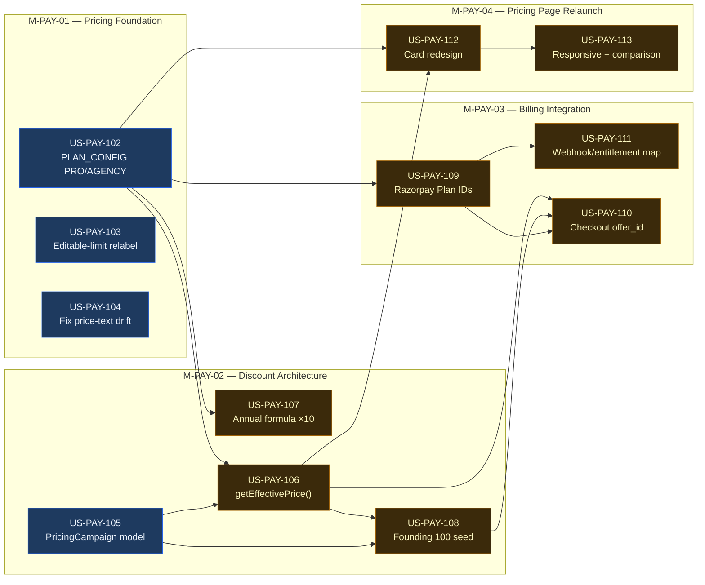

# EPIC-PAY-05 — Pricing Relaunch (Founding Customer Launch)

> **Phase:** Phase 1 — Revenue Strategy
> **Status:** 🔲 Not Started
> **Linear Project:** LIN-EPIC-XXX
> **Target date:** before US-LAUNCH-005 AC6 (real ₹ transaction) and before/alongside `BETA_MODE=false`
> **Owner:** Dinesh
> **Source:** [docs/agile/PRD/2026-08-21-pricing-relaunch.md](../../../PRD/2026-08-21-pricing-relaunch.md)
>
> **Naming note:** `EPIC-PAY-02` (payment-method UI), `EPIC-PAY-03` (Stripe activation), and
> `EPIC-PAY-04` (API-tier volume pricing) are pre-existing `PHASE_TRACKER.md` placeholders for
> distinct, later-phase work — none scaffolded. This epic does not touch or absorb them; it took the
> next free number per `PROJECT_CONTEXT.yaml`'s counter (`epic: 5`).

---

## Goal

**Outcome:** Beta pricing (₹2,999/₹6,999/₹24,999, no PRO or AGENCY tier) is replaced with a
feasibility-checked pricing model (Free/Solo/Pro/Team/Agency/Enterprise) that clears 75–80%
contribution margin under real cost data, launches with a time-boxed Founding Customer 100 program,
and is built so the *next* promotional campaign (festival, referral, …) is a database row and a few
Razorpay dashboard clicks — not a code change.

**Why now:** Product audit + same-session feasibility analysis (2026-08-21) found current live
pricing degrades to 52% typical / 8% worst-case margin once editable-design usage is real (already
measured and partially mitigated by `US-LAUNCH-015`, 2026-08-15). This epic is the actual pricing
fix that discovery pointed at — not speculative, a direct response to a measured problem. It also
lands before the revenue-on flip (`BETA_MODE=false`), which is gated on `EPIC-INFRA-02` and
`US-LAUNCH-005` AC6 — this epic should be ready before that transaction runs on the new prices, not
the old ones.

**Success metric:** A new signup on any paid tier sees the correct regular/founding price, checks
out via Razorpay with the discount applied server-side (never client-trusted), and the founding
program can be replaced by a festival campaign later with zero deploys — verified by actually
running that swap on staging.

---

## Root Cause / Pre-Story Analysis

- **Observed problem:** `shared/schema.ts` `PLAN_CONFIG` has no PRO or AGENCY tier, no founding-price
  concept, and no campaign mechanism at all. `PricingPage.tsx:468-469` also hardcodes literal price
  text independent of `PLAN_CONFIG` — already drifts from real config today, a pre-existing bug this
  epic fixes while it's in the file anyway.
- **Underlying cause:** Pricing was built for MVP beta (get *a* number live), not for a sustainable,
  promotable, multi-campaign SaaS model. No config axis exists for "time-boxed discount," so the
  original PRD's own suggested schema (`founding_enabled`, `founding_price` as plan columns) would
  have required a new column per future campaign — the same anti-pattern this epic exists to avoid.
- **Constraints we must respect:**
  - Razorpay is the only billing provider (no replacement) — extend `payments.service.ts`'s existing
    `RAZORPAY_PLAN_*` env var pattern, don't parallel-build.
  - Razorpay Subscription Plans are price-immutable once created — discounts must use Razorpay's
    `Offer`/`offer_id` mechanism (verified against live docs 2026-08-21:
    https://razorpay.com/docs/payments/subscriptions/offers/), not a new Plan per campaign.
  - `UsageLimitService` is already the centralized entitlement point — extend, don't parallel-build.
  - Product currently has **no paying customers** (beta) — clean migration, not legacy data
    preservation, is the priority (per original PRD instruction).
  - The editable-design credit mechanism this PRD originally specified conflicts with what actually
    shipped 6 days ago (`US-LAUNCH-015`) — resolved as an explicit decision below, not silently
    picked.
- **What success looks like:** Pricing page shows Free/Solo/Pro/Team/Agency/Enterprise with correct
  regular + founding prices; checkout charges the right amount; a second campaign can be launched
  without a code deploy; margin holds per the validated numbers below.

---

## Feasibility — validated this session, not just proposed

Full analysis: [docs/agile/PRD/2026-08-21-pricing-relaunch.md §2](../../../PRD/2026-08-21-pricing-relaunch.md).
Summary: verified against real code constants (Ideogram $0.06 generate / $0.09 editable, LLM $0.004
flat) and real production data (`UsageRecord` table, 107 real records, $0.1195/unit blended average;
live Railway metrics, <5% CPU/memory utilization confirming infra marginal cost is negligible at
current scale). **All 4 paid tiers clear 75–80% margin** at both 100%-utilization worst case
(90.3–91.5% regular / 86.8–89.1% founding) and realistic 60%/50%-utilization average case
(93.2–93.7%). This is a real fix to a measured problem (current Team margin: 52% typical / 8%
worst-case with editable usage), not a speculative price increase.

---

## Two decisions locked before story-writing (do not re-litigate in individual stories)

### 1. Campaigns vs. annual discount are two separate, independently-configured mechanisms

- **Campaigns** (Founding, festival, future) — `PricingCampaign` model, time-boxed, toggled,
  `isActive` (only one at a time), tied to Razorpay `Offer` objects. See F-PAY-02.
- **Annual discount** — a standing, always-on, ×10 (2-months-free) structural discount, same
  category as Claude/Cursor's annual pricing — never toggled, never expires, composes with whatever
  campaign is active. **Corrected 2026-08-21**: for `PERCENT`-type campaign discounts (the only
  type any campaign uses today, including Founding-100), composition order with the ×10 multiplier
  is mathematically irrelevant — both are multiplicative, and multiplication commutes
  (`549900 × 0.7273 × 10 == 549900 × 10 × 0.7273`). This isn't a product decision needing sign-off,
  it's arithmetic. It only becomes a real design question for a future `FLAT` (rupee-amount)
  campaign discount, which `US-PAY-106` explicitly rejects rather than silently mis-computing —
  see that story for the reasoning.
- **The original PRD's annual math had a labeling bug**: `₹5,499 × 12 →` is written but the shown
  figures (₹54,990 etc.) are actually `× 10`. Use `× 10` — verified: `5,499 × 10 = 54,990` ✓,
  `5,499 × 12 = 65,988` ✗. The current codebase's *existing* formula (`× 12 × 0.85`,
  `PricingPage.tsx:176-182`) is a third, different number — must be replaced, not left coexisting.

### 2. Editable-design limits — Path A (relabel), not the PRD's literal always-deducted model

The original PRD describes editable designs as a second, always-deducted quota. What's live today
(`US-LAUNCH-015`, `generations.service.ts:337-389`) is different: first compose per generation free
on paid tiers, only additional distinct-variation composes meter against the *shared* credit pool,
FREE gets a lifetime trial. **This epic keeps that mechanism and only changes its display** ("10
editable/month" becomes a UI-level allowance number, not a literal second counter) — the smaller,
lower-risk change that doesn't undo tested behavior. Reversing to the PRD's literal model (Path B)
was considered and explicitly not chosen; if that's wrong, say so before `US-PAY-103` is hardened.

---

## Features in this Epic

| Feature ID | Scope | Stories | Status |
|------------|-------|---------|:------:|
| [F-PAY-01](features/F-PAY-01/FEATURE.md) | Pricing configuration & entitlements | US-PAY-102, 103, 104 | 🔲 |
| [F-PAY-02](features/F-PAY-02/FEATURE.md) | Discount & campaign architecture | US-PAY-105, 106, 107, 108 | 🔲 |
| [F-PAY-03](features/F-PAY-03/FEATURE.md) | Billing integration (Razorpay) | US-PAY-109, 110, 111 | 🔲 |
| [F-PAY-04](features/F-PAY-04/FEATURE.md) | Pricing page relaunch | US-PAY-112, 113 | 🔲 |

---

## Milestones

| Milestone | Scope | Target | Status |
|-----------|-------|--------|:------:|
| [M-PAY-01-pricing-foundation](milestones/M-PAY-01-pricing-foundation.md) | Config model, tiers, editable-limit relabel, drift-bug fix | TBD | 🔲 |
| [M-PAY-02-discount-architecture](milestones/M-PAY-02-discount-architecture.md) | PricingCampaign model, price resolution, annual formula, Founding 100 seed | TBD | 🔲 |
| [M-PAY-03-billing-integration](milestones/M-PAY-03-billing-integration.md) | Razorpay Plan IDs, checkout `offer_id`, webhook/entitlement mapping | TBD | 🔲 |
| [M-PAY-04-pricing-page-relaunch](milestones/M-PAY-04-pricing-page-relaunch.md) | Card redesign, founding UX, responsive, comparison section | TBD | 🔲 |

---

## Stories in this Epic

| Order | Story ID | Title | Feature | Milestone | Size | Blocked By | Status | PR |
|:-----:|----------|-------|---------|-----------|:----:|------------|:------:|:--:|
| 1 | [US-PAY-102](stories/US-PAY-102/STORY.md) | Extend PLAN_CONFIG with PRO and AGENCY tiers | F-PAY-01 | M-PAY-01 | M | — | 🔲 | — |
| 1 | [US-PAY-103](stories/US-PAY-103/STORY.md) | Editable-design limit relabel (Path A) | F-PAY-01 | M-PAY-01 | S | — | 🔲 | — |
| 1 | [US-PAY-104](stories/US-PAY-104/STORY.md) | Fix PricingPage.tsx hardcoded price-text drift | F-PAY-01 | M-PAY-01 | XS | — | 🔲 | — |
| 1 | [US-PAY-105](stories/US-PAY-105/STORY.md) | PricingCampaign Prisma model + migration | F-PAY-02 | M-PAY-02 | S | — | 🔲 | — |
| 1 | [US-PAY-107](stories/US-PAY-107/STORY.md) | Standing annual-discount formula (×10) | F-PAY-02 | M-PAY-02 | S | US-PAY-102 | 🔲 | — |
| 2 | [US-PAY-106](stories/US-PAY-106/STORY.md) | `getEffectivePrice()` resolution service | F-PAY-02 | M-PAY-02 | M | US-PAY-102, US-PAY-105 | 🔲 | — |
| 1 | [US-PAY-109](stories/US-PAY-109/STORY.md) | New Razorpay Plan IDs for PRO/AGENCY tiers | F-PAY-03 | M-PAY-03 | S | US-PAY-102 | 🔲 | — |
| 3 | [US-PAY-108](stories/US-PAY-108/STORY.md) | Founding Customer 100 campaign seed + Offer linkage | F-PAY-02 | M-PAY-02 | M | US-PAY-105, US-PAY-106 | 🔲 | — |
| 2 | [US-PAY-111](stories/US-PAY-111/STORY.md) | Webhook/entitlement mapping for new tiers | F-PAY-03 | M-PAY-03 | S | US-PAY-109 | 🔲 | — |
| 2 | [US-PAY-110](stories/US-PAY-110/STORY.md) | Checkout passes `offer_id` server-side | F-PAY-03 | M-PAY-03 | M | US-PAY-106, US-PAY-108, US-PAY-109 | 🔲 | — |
| 1 | [US-PAY-112](stories/US-PAY-112/STORY.md) | Pricing page redesign — cards, founding badge, toggle | F-PAY-04 | M-PAY-04 | L | US-PAY-102, US-PAY-106 | 🔲 | — |
| 2 | [US-PAY-113](stories/US-PAY-113/STORY.md) | Responsive layout + comparison section + messaging | F-PAY-04 | M-PAY-04 | S | US-PAY-112 | 🔲 | — |

---

## Story Dependency DAG

---

## Files touched (inventory)

| File / Module | Owner Story | Layer | Status |
|---------------|-------------|-------|:------:|
| `shared/schema.ts` (`PLAN_CONFIG`) | US-PAY-102, US-PAY-103 | shared | 🔲 |
| `api/prisma/schema.prisma` (`PricingCampaign` model) | US-PAY-105 | backend | 🔲 |
| `api/src/modules/payments/services/pricing-resolution.service.ts` (new) | US-PAY-106, US-PAY-107 | backend | 🔲 |
| `api/src/modules/infographics/services/usage-limit.service.ts` | US-PAY-103 | backend | 🔲 |
| `api/src/modules/infographics/services/generations.service.ts` | US-PAY-103 | backend | 🔲 |
| `api/src/modules/payments/services/payments.service.ts` | US-PAY-109, US-PAY-110, US-PAY-111 | backend | 🔲 |
| `.env.example` (`RAZORPAY_PLAN_PRO_*`, `RAZORPAY_PLAN_AGENCY_*`) | US-PAY-109 | config | 🔲 |
| `client/src/pages/PricingPage.tsx` | US-PAY-104, US-PAY-112, US-PAY-113 | frontend | 🔲 |
| `client/src/pages/LandingPage.tsx` (pricing section) | US-PAY-112 | frontend | 🔲 |

---

## Architecture Notes (inline)

- **Entry points:** `PricingPage.tsx` (display), `payments.service.ts` `createSubscription()` (checkout), Razorpay webhook handler (entitlement activation).
- **Key abstractions:** `PLAN_CONFIG` (tier definitions, shared FE/BE), `UsageLimitService` (entitlement checks), new `pricing-resolution.service.ts` (`getEffectivePrice(tier, interval)` — composes base price × active campaign discount × annual multiplier).
- **Data contracts:** `PLAN_CONFIG` shape extends (adds `PRO`, `AGENCY`, editable-limit display field) — do not break existing `FREE`/`SOLO`/`TEAM`/`BROKERAGE` consumers. New `PricingCampaign` Prisma model, additive only.
- **Patterns to follow:** single source of truth (`PLAN_CONFIG` → both FE and BE import it, no duplicated price literals — `PricingPage.tsx:468-469`'s hardcoded string is the anti-pattern being fixed, don't reintroduce it); entitlement checks go through `UsageLimitService`, never scattered `if (tier === ...)`.
- **Token / config replacements:**
  | Token | Replaces | Where |
  |-------|----------|-------|
  | `RAZORPAY_PLAN_PRO_MONTHLY` / `_ANNUAL` | new env vars, human-created in Razorpay dashboard | `.env`, `payments.service.ts:25-53` |
  | `RAZORPAY_PLAN_AGENCY_MONTHLY` / `_ANNUAL` | new env vars, human-created in Razorpay dashboard | `.env`, `payments.service.ts:25-53` |
  | `RAZORPAY_OFFER_FOUNDING_<TIER>` | new Razorpay Offer IDs, human-created for the Founding campaign | `PricingCampaign.tierDiscounts` JSON |

For the visual diagram see [ARCHITECTURE.mmd](./ARCHITECTURE.mmd).
For environment variables see [ENV.yaml](./ENV.yaml).

---

## Out of Scope (Epic Level)

- API-tier compose pricing (deferred, API plans on hold — `US-LAUNCH-015` STORY.md).
- White-label / client-workspace implementation beyond what the app already supports.
- Any change to AI model selection/cost routing (Gemini/GPT-4o tier routing is unchanged).
- Fixed Enterprise pricing (stays "Contact Sales").
- Migrating/repricing any existing BROKERAGE subscriber to AGENCY — different volume (1,000 vs
  400/mo), flagged as a real decision, not silently automated.
- Reversing `US-LAUNCH-015`'s editable-compose mechanism (Path B) — see decision above.
- Razorpay Offer creation automation — first pass is a documented human dashboard step, same
  category as existing `RAZORPAY_PLAN_*` setup.

---

## Definition of Done (Epic)

- [ ] All milestones closed
- [ ] All stories have PR merged and STORY.md status = ✅ Done
- [ ] Verified on staging: signup → correct price shown → checkout → correct amount charged →
      entitlement active, for at least one regular and one founding-price tier
- [ ] All verification gates pass (see PROJECT_CONTEXT.yaml.gates)
- [ ] PHASE_TRACKER.md updated
- [ ] AGILE_INDEX.md epic row updated to ✅ Done

---

## Implementation Update (log)

### 2026-08-21 — Epic scaffolded from PRD
- **PRD:** [docs/agile/PRD/2026-08-21-pricing-relaunch.md](../../../PRD/2026-08-21-pricing-relaunch.md)
- **Feasibility validated** against real code + real production data before scaffolding (see §
  "Feasibility" above) — margin target confirmed achievable, not assumed.
- **Two decisions locked** before story-writing: campaigns vs. annual discount are separate systems;
  editable-design limits keep the shipped `US-LAUNCH-015` mechanism (Path A, relabel only).
- **Naming conflict caught and avoided**: `PHASE_TRACKER.md` already reserves `EPIC-PAY-02/03/04`
  for unrelated future work — this epic used the next free number (`EPIC-PAY-05`) per
  `PROJECT_CONTEXT.yaml`'s counter, not the first available-looking gap.
- **Counter drift found and fixed**: `docs/agile/PROJECT_CONTEXT.md`'s PAY row showed `02/01/001`
  while the canonical `PROJECT_CONTEXT.yaml` already had `epic:5, feature:1, story:102` — same class
  of staleness previously found and fixed for the AI domain (2026-08-20).

---

*Epic created: 2026-08-21 | Last updated: 2026-08-21*
