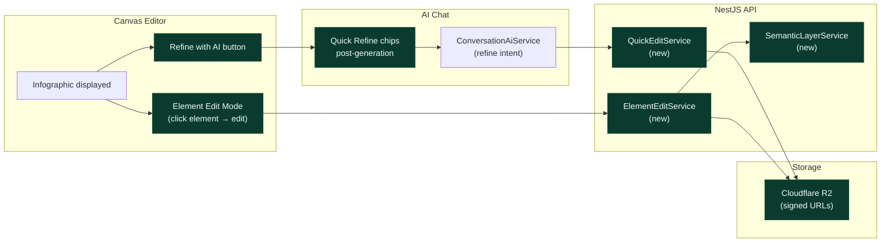

# EPIC-AI-03 — Refine Loop

> **Phase:** Phase 2 — Refine Loop (Month 3–6)
> **Status:** 🔲 Not Started
> **Depends on:** EPIC-AI-01 + EPIC-AI-02 complete
> **Linear Project:** LIN-EPIC-AI-03
> **Target date:** 2026-10-31
> **Owner:** Dinesh

---

## Goal

**Outcome:** Agents stop regenerating from scratch every time something is slightly wrong. The refine loop (quick chips, canvas edit, element targeting, semantic layer) makes each generated infographic a starting point, not a final product — dramatically increasing the value per generation.

**Why now:** This is the retention + ARPU driver. TEAM plan ($84/mo) becomes compelling when agents can refine without wasting credits. BROKERAGE trial-to-paid improves from editing efficiency.

**Success metric:** Quick Refine chip generates a modified version in <15s. Element edit ("change price to $950k") produces correct output. R2 storage makes images accessible 30 days after creation. "Refine with AI" button appears on canvas when infographic is selected.

---

## Milestones

| Milestone | Scope | Target | Status |
|-----------|-------|--------|--------|
| [M-AI-08-quick-refine](milestones/M-AI-08-quick-refine.md) | Quick Refine chips + Refine with AI from canvas | 2026-08-31 | 🔲 |
| [M-AI-09-element-edit](milestones/M-AI-09-element-edit.md) | Element Edit Mode + Edit listing details in image | 2026-09-30 | 🔲 |
| [M-AI-10-semantic-layer](milestones/M-AI-10-semantic-layer.md) | Semantic layer split + R2 asset storage | 2026-10-15 | 🔲 |
| [M-AI-11-media-tools](milestones/M-AI-11-media-tools.md) | Background removal + Upscale to Print Quality | 2026-10-31 | 🔲 |

---

## Stories in this Epic

| Story ID | Title | Milestone | Status | PR |
|----------|-------|-----------|--------|----|
| [US-AI-015](stories/US-AI-015/STORY.md) | Quick Refine chips post-generation (CAP-11) | M-AI-08 | 🔲 | — |
| [US-AI-016](stories/US-AI-016/STORY.md) | "Refine with AI" from canvas editor (CAP-12) | M-AI-08 | 🔲 | — |
| [US-AI-017](stories/US-AI-017/STORY.md) | Element Edit Mode — targeted modifications (CAP-13) | M-AI-09 | 🔲 | — |
| [US-AI-018](stories/US-AI-018/STORY.md) | Edit listing details in image — text-in-image (CAP-14) | M-AI-09 | 🔲 | — |
| [US-AI-019](stories/US-AI-019/STORY.md) | Infographic semantic layer split (CAP-15) | M-AI-10 | 🔲 | — |
| [US-AI-020](stories/US-AI-020/STORY.md) | Cloudflare R2 asset storage + signed URLs | M-AI-10 | 🔲 | — |
| [US-AI-021](stories/US-AI-021/STORY.md) | Property photo background removal (CAP-16) | M-AI-11 | 🔲 | — |
| [US-AI-022](stories/US-AI-022/STORY.md) | Upscale to Print Quality — 4K output (CAP-17) | M-AI-11 | 🔲 | — |

---

## Features in this Epic

| Feature ID | Scope | Stories |
|------------|-------|---------|
| F-AI-03-01 | Quick Refine + Canvas-to-Chat connection | US-AI-015, US-AI-016 |
| F-AI-03-02 | Targeted element editing | US-AI-017, US-AI-018 |
| F-AI-03-03 | Semantic layer + durable storage | US-AI-019, US-AI-020 |
| F-AI-03-04 | Photo tools (background removal + upscale) | US-AI-021, US-AI-022 |

---

## Out of Scope (Epic Level)

- Campaign Mode 4-piece generation (EPIC-AI-04)
- Mockup generation (EPIC-AI-04)
- Market data enrichment (EPIC-AI-05)
- Agent profile persistence (EPIC-AI-05)

---

## Definition of Done (Epic)

- [ ] All milestones closed
- [ ] All stories have PR merged and STORY.md status = ✅ Done
- [ ] Quick Refine chip generates modified version in <15s
- [ ] Element Edit: "change price to $950k" produces correct output
- [ ] Images accessible 30 days after creation (R2 storage)
- [ ] "Refine with AI" button on canvas → opens chat with infographic context
- [ ] Background removal works on uploaded property photos
- [ ] `npm run check` + `npm run test:unit` passing
- [ ] AGILE_INDEX.md epic row updated to ✅ Done

---

## Architecture Notes

See [ARCHITECTURE.mmd](./ARCHITECTURE.mmd).



Key files relevant to this epic:
```
- client/src/components/editor/CanvasEditor.tsx (or similar)
- client/src/components/ai-chat/AIChatBox.tsx
- api/src/modules/ai-generation/services/ (new QuickEditService, ElementEditService)
- api/src/config/storage.config.ts (new — R2 configuration)
```

---

*Epic created: 2026-04-28 | Last updated: 2026-04-28*
