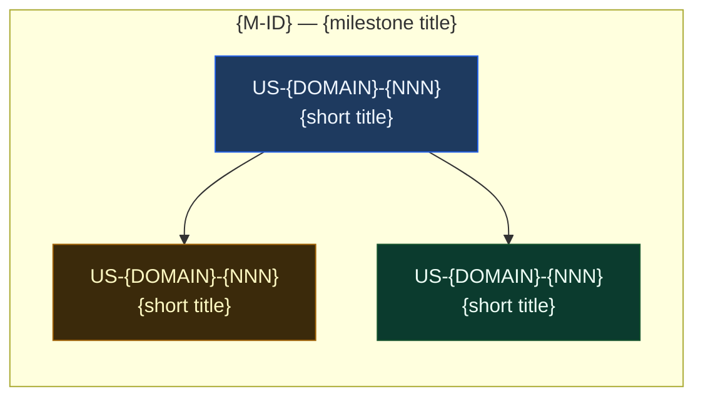

# EPIC-{DOMAIN}-{NN} — {Short Epic Title}

> **Phase:** Phase {N} — {Phase name}
> **Status:** 🔲 Not Started | 🟡 In Progress | ✅ Done
> **Linear Project:** LIN-EPIC-XXX
> **Target date:** YYYY-MM-DD
> **Owner:** {name}

---

## Goal

**Outcome:** {One sentence — what changes for the user when this epic is done}

**Why now:** {The business or product reason driving this work}

**Success metric:** {How we know it's done — e.g. "X works end-to-end on staging"}

---

## Root Cause / Pre-Story Analysis

> Filled by pm-agent or human before stories are written. Captures the "why" behind the epic — the
> friction, gap, or insight that justifies the work. Without this, stories drift toward solutions
> for problems no one stated.

- **Observed problem:** {what users / the system are doing today that hurts}
- **Underlying cause:** {the root reason, not the surface symptom}
- **Constraints we must respect:** {tech, contractual, timing}
- **What success looks like:** {observable change in user behavior or system metric}

---

## Features in this Epic

| Feature ID | Scope | Stories | Status |
|------------|-------|---------|:------:|
| F-{DOMAIN}-{NN} | {feature name} | US-{DOMAIN}-{NNN}, … | 🔲 |
| F-{DOMAIN}-{NN} | {feature name} | US-{DOMAIN}-{NNN}, … | 🔲 |

---

## Milestones

| Milestone | Scope | Target | Status |
|-----------|-------|--------|:------:|
| [M-{DOMAIN}-{NN}-{slug}](milestones/M-{DOMAIN}-{NN}-{slug}.md) | {one-liner} | YYYY-MM-DD | 🔲 |
| [M-{DOMAIN}-{NN}-{slug}](milestones/M-{DOMAIN}-{NN}-{slug}.md) | {one-liner} | YYYY-MM-DD | 🔲 |

---

## Stories in this Epic

> Populated by `/prd-to-roadmap` or `/new-story`. Order column matches dependency order (1 = first).

| Order | Story ID | Title | Feature | Milestone | Size | Blocked By | Status | PR |
|:-----:|----------|-------|---------|-----------|:----:|------------|:------:|:--:|
| 1 | [US-{DOMAIN}-{NNN}](stories/US-{DOMAIN}-{NNN}/STORY.md) | {title} | F-{NN} | M-{NN} | M | — | 🔲 | — |
| 2 | [US-{DOMAIN}-{NNN}](stories/US-{DOMAIN}-{NNN}/STORY.md) | {title} | F-{NN} | M-{NN} | S | US-{prev} | 🔲 | — |

---

## Story Dependency DAG

> Generated by pm-agent or `/prd-to-roadmap`. Reflects the order column above visually so
> reviewers can spot parallel work and critical paths at a glance.

---

## Files touched (inventory)

> Maintained as stories land. Tells reviewers and future agents which files this epic actually owns
> so cross-epic changes can be coordinated.

| File / Module | Owner Story | Layer | Status |
|---------------|-------------|-------|:------:|
| `path/to/file.ext` | US-{DOMAIN}-{NNN} | frontend | 🔲 |
| `path/to/another/file.ext` | US-{DOMAIN}-{NNN} | backend | 🔲 |

---

## Architecture Notes (inline)

> Inline architecture context — file paths, code patterns, token-replacement tables, gotchas.
> Lives here (not just in ARCHITECTURE.mmd) because story-writers and code-agent read EPIC.md
> as the first source of truth.

- **Entry points:** {where requests enter — files / routes}
- **Key abstractions:** {service boundaries, primary interfaces}
- **Data contracts:** {schemas / DTOs that must stay stable}
- **Patterns to follow:** {project-specific idioms — see also `.orion/rules/`}
- **Token / config replacements:**
  | Token | Replaces | Where |
  |-------|----------|-------|
  | `{TOKEN}` | {actual value or env var} | `path/to/file.ext` |

For the visual diagram see [ARCHITECTURE.mmd](./ARCHITECTURE.mmd).
For environment variables see [ENV.yaml](./ENV.yaml).

---

## Out of Scope (Epic Level)

- {Explicit thing that does NOT belong in this epic}
- {Another out-of-scope item}

---

## Definition of Done (Epic)

- [ ] All milestones closed
- [ ] All stories have PR merged and STORY.md status = ✅ Done
- [ ] Verified on staging environment
- [ ] All verification gates pass (see PROJECT_CONTEXT.yaml.gates)
- [ ] PHASE_TRACKER.md updated
- [ ] AGILE_INDEX.md epic row updated to ✅ Done

---

## Implementation Update (log)

> Append a dated entry each time a story closes, a milestone closes, or a material decision is made.
> Maintained by `/close-story` (auto) and humans (manual entries).
> Newest entries at the top.

### YYYY-MM-DD — {one-line summary}
- **Story:** US-{DOMAIN}-{NNN} merged ([PR #{N}](https://github.com/{org}/{repo}/pull/{N}))
- **Files touched:** `{file1}`, `{file2}`
- **ACs covered:** AC1, AC2
- **Notes:** {decisions, surprises, follow-ups}

---

*Epic created: YYYY-MM-DD | Last updated: YYYY-MM-DD*
