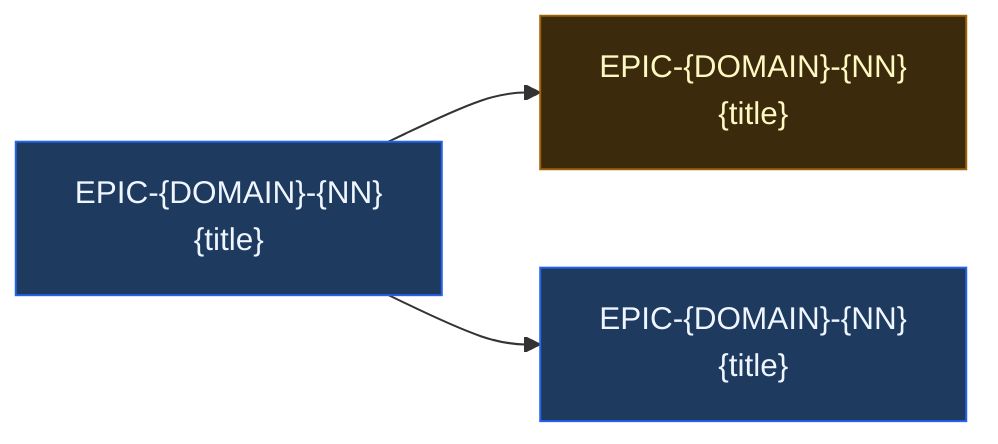

# Phase {N} — {Phase Name}

> **Release:** v{X.Y}
> **Status:** 🔲 Planning · 🟡 In Progress · ✅ Done
> **Target date:** YYYY-MM-DD
> **Owner:** {name or "team"}

---

## Outcome

{One sentence — what changes for the user when this phase closes.}

**Why now:** {The business or product reason driving this phase.}

---

## Epics in this Phase

| Epic | Title | Stories | Status | Target |
|------|-------|:-------:|:------:|--------|
| [EPIC-{DOMAIN}-{NN}](EPIC-{DOMAIN}-{NN}/EPIC.md) | {title} | {N} | 🔲 | YYYY-MM-DD |
| [EPIC-{DOMAIN}-{NN}](EPIC-{DOMAIN}-{NN}/EPIC.md) | {title} | {N} | 🔲 | YYYY-MM-DD |

---

## Epic Dependency DAG

> Generated by pm-agent. Shows which epics block which — read left to right.

**Critical path:** {longest dependency chain — list epic IDs in order}

**Parallel tracks:** {epics that can run in parallel — list groups}

---

## Phase Gate (must be true before closing)

- [ ] All epics in this phase are ✅ Done
- [ ] All cross-epic dependencies resolved
- [ ] {Domain-specific gate — e.g., "Auth flow demo'd on staging"}
- [ ] {Verification gate from PROJECT_CONTEXT.yaml.gates pass on the integrated build}
- [ ] PHASE_TRACKER.md updated; ROADMAP.md marks this phase Done

---

## Suggested first story

> The story that, when implemented, unblocks the most downstream work. pm-agent computes this from the DAG.

**Start here:** [US-{DOMAIN}-{NNN}](EPIC-{DOMAIN}-{NN}/stories/US-{DOMAIN}-{NNN}/STORY.md) — {title}

Why first: {reason — usually "no dependencies + unblocks N downstream stories"}

---

## Cross-Phase Dependencies

> When stories in this phase depend on epics in other phases, list them here so they don't surprise anyone.

| This Phase | Depends On | Type | Notes |
|------------|-----------|------|-------|
| US-{DOMAIN}-{NNN} | EPIC-{OTHER}-{NN} (Phase {M}) | hard | {one-line context} |

---

## Notes

- {Anything specific to this phase — risk, owner change, prior incident, etc.}

---

*Phase folder created: YYYY-MM-DD | Last updated: YYYY-MM-DD*
