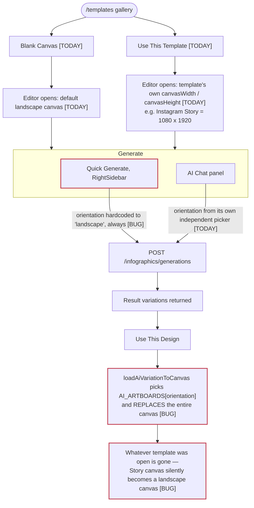
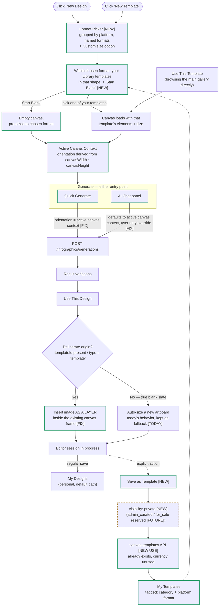

# Template & Design Workflow — Current State vs. Proposed

> **Status:** Design agreed 2026-07-29. Feeds three stories in [EPIC-AI-02](../agile/epics/phase-1-ai-core/EPIC-AI-02/EPIC.md):
> [US-AI-036](../agile/epics/phase-1-ai-core/EPIC-AI-02/stories/US-AI-036/STORY.md) (orientation fix),
> [US-AI-037](../agile/epics/phase-1-ai-core/EPIC-AI-02/stories/US-AI-037/STORY.md) (Save as Template),
> [US-AI-038](../agile/epics/phase-1-ai-core/EPIC-AI-02/stories/US-AI-038/STORY.md) (Format Picker).
> Supersedes the original scope of [US-AI-011](../agile/epics/phase-1-ai-core/EPIC-AI-02/stories/US-AI-011/STORY.md).

**Subject:** how "New Design," "Use This Template," and "New Template" should relate to generation orientation in the Buildographic editor.
**Purpose:** agree on the flow before we cut a story. Nothing here is implemented yet.
**Status:** v4 — all open decisions resolved. Ready to size.

---

## Legend

- **[TODAY]** — what the code does right now, and it's fine as-is
- **[BUG]** — what the code does right now, and it's wrong
- **[FIX]** — same step, corrected behavior
- **[NEW]** — doesn't exist today
- **[FUTURE]** — deliberately not built now, but the data model shouldn't block it later

---

## 1. Current flow — traced directly from the code

**The concrete failure case:** open the "Instagram Story" template (1080×1920) → click Quick Generate → it generates landscape regardless → click "Use This Design" → the Story canvas is gone, replaced by a new 1280×720 landscape canvas.

---

## 2. Proposed flow — v4: two buttons, one shared path

**Resolved:** "New Design" and "New Template" stay as two separate, visible buttons (kept for discoverability/simplicity — a new user can see template-authoring is a real option without hunting for it). What's unified is everything *after* the click: both buttons open the identical Format Picker → Library → canvas flow. They diverge only at *save* time — regular save vs. explicit "Save as Template."

Both buttons feed the same `Picker` node above — there's exactly one Format Picker implementation, one Library-browsing implementation, one canvas-context-establishment path. "Two buttons" is a UI-layer decision only; it doesn't fork the underlying logic or double the engineering.

---

## 3. Format Picker — taxonomy (unchanged from v2, finer-grained as requested)

| Platform group | Named format | Dimensions | Orientation bucket |
|---|---|---|---|
| **Instagram** | Post | 1080×1080 | square |
| | Story | 1080×1920 | portrait |
| | Reel Cover | 1080×1920 | portrait |
| **Facebook** | Post | 1200×1200 | square |
| | Cover | 1200×628 | landscape |
| | Story | 1080×1920 | portrait |
| **Print** | Flyer (4:3) | 1600×1200 | landscape |
| | Postcard | 1800×1200 | landscape |
| | Open House Sign | 1200×1800 | portrait |
| **Email** | Header Banner | 1200×400 | landscape |
| **Other** | LinkedIn Post | 1200×1200 | square |
| | Custom size… | user-entered | derived |

Each named format still resolves to one of the three `AI_ARTBOARDS` buckets (`landscape` / `portrait` / `square`) for generation — the fine-grained tag is what the *template* is labeled and browsed by; generation orientation stays the simple three-way bucket underneath.

---

## 4. Decisions — status

1. **Who can save templates?** ✅ Personal-first (My Templates, private by default); admin-curated + for-sale marketplace reserved for later.
2. **Platform tag taxonomy** ✅ Finer-grained, per table above.
3. **"Deliberately open" threshold** ✅ `templateId` present / `type: 'template'` origin = deliberate.
4. **Does New Design get the Format Picker too?** ✅ Yes — and it also surfaces the user's own Library within the chosen format, with "Start Blank" as one of the choices, not the only one.
5. **Should "New Design" and "New Template" collapse into one button?** ✅ Resolved — kept as two separate buttons, for simplicity/discoverability. The shared picker → library → canvas logic underneath is unchanged either way; this was purely a UI-layer call.

---

## 5. Why the data model should plan for the marketplace now, even unbuilt

Retrofitting "this template can be sold" onto a system that assumed every template is either default-seeded or private is the expensive path. Cheap, now: give every saved template a `visibility` field with three states from day one — `private` (default, the only one with UI behind it), `admin_curated` (reserved), `for_sale` (reserved). Costs nothing extra today; makes the future review/marketplace work additive instead of a migration.

---

## 6. Usability thoughts

**Ordering inside the Library step matters more now that it's central, not a fallback.** Once a format is picked, if the user already has templates saved in that shape, I'd show *those* first (they're deliberately curated, likely the ones worth reusing) with "Start Blank" as a persistent, always-visible tile rather than necessarily first-in-line. For a brand-new user with an empty library, it degrades gracefully — "Start Blank" is just the only tile shown, no empty-state awkwardness needed.

**Named tiles with a shape preview, never a dropdown of numbers.** A small rectangle silhouette next to "Instagram Story" communicates more in 200ms than "1080×1920." Also keeps this consistent with the project's existing rule that no technical specs are shown to users.

**Always keep "Custom size."** Real estate print requirements (a specific postcard vendor's spec, a local paper's ad slot) will never fit a fixed list. Every tool that does this well (Canva, Figma, PowerPoint) keeps custom size as a permanent option in the same picker, not buried in settings.

**Remember the last format used.** If someone only ever makes Instagram Posts, don't make them re-pick it every session — pre-highlight or float their most-used format to the top. This is what keeps a "ask every time" picker from feeling like a tollbooth instead of a helpful step.

**On keeping two buttons (§4.5, resolved):** since both now open the identical picker, the two-button choice costs nothing in engineering — it's purely about signaling. Worth carrying into copy/labeling when this gets built: make sure "New Template" doesn't *feel* like a heavier/more technical action than "New Design" (e.g. avoid implying it's an "advanced" or "admin" feature), since anyone can use it now.

---

*All decisions resolved — ready to size. Three independently shippable stories: (a) the orientation bug fix + insert-as-layer logic, (b) Save-as-Template + visibility field + My Templates surface, (c) the Format Picker (two entry buttons, shared implementation) + Library browsing + taxonomy.*

---

*Document created: 2026-07-29. Originally drafted as a Claude Artifact during design discussion; persisted here as the permanent record.*
